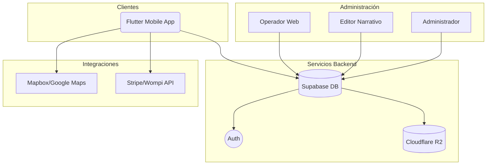
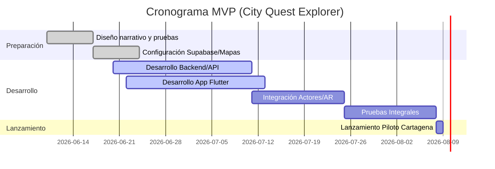

```markdown
# FASE-01-BIBLIA-NARRATIVA.md

## Resumen Ejecutivo
Esta fase define la historia principal de *El Manuscrito Prohibido*, incluyendo la trama, ambientación, tono y reglas narrativas del juego. Se presenta la ambientación histórica en Cartagena, el trasfondo del manuscrito y los objetivos del jugador. Además, se alinea la narrativa con la estrategia de recursos cero en software (uso de plataformas gratuitas y herramientas Open Source) y con la producción física escalonada de la caja y los regalos (fabricados semanalmente).

## Objetivo
Establecer la **idea central** y el universo narrativo del juego:
- Plantear la leyenda del Manuscrito Prohibido.
- Definir contexto histórico y geográfico (Cartagena Colonial).
- Determinar el objetivo final del jugador (descubrir secretos y convertirse en Guardián del legado).

## Contenido Clave
- **Trama**: Explicación de la desaparición de custodia del manuscrito, sociedades secretas (custodios, Observador, Guardián).
- **Ambientación**: Año de iniciación (ej. 1720 Cartagena), elementos culturales, vestuario y locaciones relevantes (murallas, plazas coloniales, bosques de Camellón).
- **Tono narrativo**: Misterio histórico, aventura aventurera, estilo cinematográfico (inspirado en *National Treasure*, *Sherlock Holmes*).
- **Reglas del juego**: Regla de la inmersión, nadie sabe toda la verdad, se usan pistas parciales, elementos de intriga.

## Cambios Realizados
- Adaptación a recursos mínimos: Se prioriza el uso de herramientas gratuitas (App móvil usando Flutter, backend en Supabase Free, mapas de OpenStreetMap/Mapbox Free).
- Multidioma (español/inglés) contemplado en la narrativa desde el inicio.
- Sistema de acceso sin registro: los jugadores recibirán un **código único** al comprar en la web para ingresar al juego, evitando complejo registro.
- Producción física escalonada: la caja de investigación y el “gifting” (souvenirs) se producen semanalmente según demanda, permitiendo diluir costos iniciales.
- Ajuste de precios: experiencia individual a 100.000 COP, equipo hasta 5 a 400.000 COP (permite caja y obsequios de calidad).

## Dependencias Técnicas
- **Plataforma móvil**: Flutter (iOS/Android) o PWA futura.
- **Backend/BD**: Supabase Free (2 proyectos, 500 MB BD, 5 GB egress).
- **Autenticación**: Login por código o social (Google/Apple).
- **Mapas**: Mapbox Free (≈10.000 vistas/mes) o Google Maps con crédito gratis.
- **Notificaciones/Chatbot**: ARIADNA (usará respuestas pregrabadas + IA libre tipo GPT-3.5 o GPT-4 con límites gratuitos).
- **Medios**: Videos (grabación digital), audio (micrófonos), libreta/papelería.

## Archivos Multimedia Necesarios
- **Imágenes**: Fotografías de Cartagena colonial (fachadas, plazas, murallas) para ambientar.
- **Videos**: Grabaciones de Isabella, NPCs, escena postcréditos.
- **Audios**: Grabaciones de guion de ARIADNA, mensajes del Mensajero, testimonios sonoros.
- **Documentos**: Mapa antiguo, cartas escritas, recortes de periódico colonial.
- **Otros**: Diseño de la caja (vectorial), fotos de objetos (moneda, tarjeta NFC, sellos).

## Checklist de Producción
- [ ] **Historia**: Redactar guion principal y subtramas; aprobar por equipo creativo.
- [ ] **Investigación histórica**: Obtener detalles reales de Cartagena para aumentar credibilidad.
- [ ] **Definir personajes**: Perfiles y motivaciones claros (custodios, Observador, Falsificador, Guardián).
- [ ] **Diseño de puzzles**: Vincular historia con acertijos (fechas históricas, criptografía colonial).
- [ ] **Prototipado**: Crear borradores de documentos/clues.
- [ ] **Revisión legal/museografía**: Verificar permiso de uso de locaciones (espacios públicos).
- [ ] **Planificación producción**: Establecer cronograma de rodaje, grabación de voces, impresión de materiales.

## Reducción de Costos (Herramientas Gratuitas)
- **Desarrollo backend**: Utilizar Supabase (plan gratuito) con **500MB de BD** y **5GB de egress**. Similarmente, Firebase Spark ofrece niveles gratis.
- **Frontend/Hosting**: Usar **GitHub Pages** o **Netlify Free** (100 GB mensuales, 300 minutos build) para la landing page.
- **Mapas**: Mapbox free (~10K vistas/mes) o **OpenStreetMap** con Leaflet.
- **Autenticación**: Implementar login social gratuito (Google/Apple) o solo código de reserva (sin servidor de usuarios adicionales).
- **IA y Chatbot**: Emplear modelos de IA gratuitos (p. ej. GPT-3.5 con tokens limitados, o modelos open-source).
- **Edición multimedia**: Herramientas gratuitas (DaVinci Resolve, Audacity) para video/audio.
- **Plantillas y activos**: Bancos de imágenes libres (Unsplash) para escenarios; íconos vectoriales gratuitos.

```

```markdown
# FASE-02-PERSONAJES-Y-CONSPIRACION.md

## Resumen Ejecutivo
Esta fase detalla los **personajes principales y secundarios** involucrados en la historia, junto con sus motivaciones ocultas y relaciones. Define el antagonista invisible (*El Observador*) y los personajes neutrales (Mensajero, Archivero, Testigo). Se reitera la regla: *nadie conoce toda la verdad*, generando sospechas generalizadas.

## Objetivo
Describir los personajes del juego y trazar la red de conspiración:
- Fijar roles (investigador/protagonista vs. antagonistas ocultos).
- Determinar motivaciones ocultas y secretos que impulsan la trama.
- Crear un árbol de sospechosos y mapa de conspiración.

## Contenido Clave
- **Personaje principal**: Isabella (investigadora desaparecida) – su secreto clave (el manuscrito no es físico).
- **Personajes aliados ambigua**: ARIADNA (guía, IA/híbrido con agenda secreta).
- **Antagonistas**: El Observador (vigilante de secretos), El Falsificador (crea pistas falsas), El Guardián (protector final de la verdad).
- **NPCs secundarios**: Mensajero (entrega mensajes clave), Archivista (experto en archivos), Testigo (testimonio contradictorio).
- **Secretos y conspiración**: Mapa de conspiración de cinco niveles (público → secreto máximo). Árbol de sospechosos escalonado.
- **Frase emblemática**: "Toda verdad tiene un precio."

## Cambios Realizados
- Inclusión de **IA Conversacional** (ARIADNA) con doble rol (guía narrativo y guardiana de información).
- Adaptación narrativa para **doble idioma** (contenido y nombres pensados en ES/EN).
- Alineación con producción **zero budget**: no depender de personal permanente (actores por evento) y usar software gratuito para esquemas (p.ej. diagramas en Markdown).
- **Formato de conspiración**: Se simplifica árbol y niveles secretos para fácil integración en la app.

## Dependencias Técnicas
- **Base de Datos/Nodos**: Cada personaje puede mapearse a registro en DB (Supabase Free).
- **IA y Chatbot**: ARIADNA necesita acceso a modelo (puede usar GPT-4 Turbo en OpenAI u otro LLM con prompts predefinidos).
- **Audio/Video**: Equipo de grabación para Mensajero, Falsificador, Guardián.
- **Interfaz del jugador**: Perfil de personaje puede mostrarse en App (imágenes, mini-ficha).
- **Autenticación**: No necesario diferenciar rol jugador/personaje; todos son “investigadores”.

## Archivos Multimedia Necesarios
- **Retratos**: Imágenes de cada personaje (estilo cinematográfico).
- **Audio/Video**: Grabaciones de actores (Mensajero, Falsificador, Guardián).
- **Gráficos**: Diagramas del árbol de sospechosos, líneas de tiempo conspirativas.
- **Documento**: Fichas de personajes para impresión (ficha con nombre, rol, secreción aparente).
- **Elementos VR/RA**: (Opcional) Pistas visuales en realidad aumentada mediante la app.

## Checklist de Producción
- [ ] Redactar descripciones detalladas de cada personaje.
- [ ] Definir “secretos” y motivaciones ocultas.
- [ ] Crear el mapa de conspiración (niveles secretos).
- [ ] Preparar guiones de voz (Mensajero, Falsificador, Guardián).
- [ ] Diseñar fichas visuales de personajes (imagen + texto breve).
- [ ] Verificar consistencia (no se revela información crítica antes de tiempo).
- [ ] Programar la IA de ARIADNA con respuestas de pistas parciales.

## Reducción de Costos (Herramientas Gratuitas)
- **Hoja de personajes**: Guardar información en Supabase (plan free) o Airtable (gratis hasta 1000 registros).
- **Árbol de sospechosos**: Dibujarlo con herramientas open-source (draw.io/diagrams.net).
- **IA conversacional**: Se pueden combinar respuestas pregrabadas (sin costo) con LLM gratuitos para flexibilidad.
- **Actores/Eventos**: Pagar por evento (circa 60.000 COP/actor) en lugar de salario fijo.
- **Almacenamiento**: Archivos multimedia en Cloudflare R2 (10GB gratis) o GitHub.
- **Comunicación**: Usar canales gratuitos (Telegram o WhatsApp grupos cerrados) para coordinar reparto de roles y horarios.
```

```markdown
# FASE-03-MAPA-DE-EXPERIENCIA.md

## Resumen Ejecutivo
Define el **recorrido físico** del juego en Cartagena y la distribución de estaciones. Incluye un mapa general del trayecto (Plazas principales, Murallas, Castillo San Felipe). Se adapta a un uso inicial cero software: los jugadores usan sus móviles con GPS y la App sin costos, y se imprimen pistas bajo demanda. La caja de investigación reusable guía la exploración de los espacios públicos.

## Objetivo
Planificar la ruta y puntos clave para que los jugadores vivan la historia:
- Seleccionar ubicaciones emblemáticas en Cartagena (e.g. Bóvedas, Camellón, Torre del Reloj, Murallas).
- Definir 12 estaciones con pistas progresivas.
- Establecer opciones de ruta (A/B) que varíen el orden sin alterar la trama principal.

## Contenido Clave
- **Zonas de inicio**: Las Bóvedas (briefing y primera pista).
- **Zonas de desarrollo**: Camellón de los Mártires, Plaza Aduana, San Pedro Claver, Torre del Reloj, Getsemaní, Castillo San Felipe, Parque Apolo.
- **Zonas de final**: Murallas (última estación, escena final con guardián).
- **Mapa mental**: Gráfico esquemático de la ruta con puntos de interés.
- **Recorrido alternativo (A/B)**: Dos órdenes posibles para flexibilidad operacional, manteniendo siempre las 12 estaciones (ver tabla inferior).

## Cambios Realizados
- **GPS y Sinergia Digital**: La app guiará por GPS (servicio gratuito de Mapbox o OpenStreetMap).
- **QR Dinámicos**: Pistas en códigos QR (propios, administrables en Supabase para no reimprimir).
- **Acceso sin registro**: Al llegar a la zona GPS habilita contenidos sin login.
- **Caja Reutilizable**: La caja física se diseña durable para múltiples equipos; sólo se reponen consumibles por semana.

## Dependencias Técnicas
- **GPS**: Disponibilidad de señal móvil en la ciudad (Smartphone del jugador).
- **Mapas**: Integración con Mapbox (nivel gratuito, ~10.000 cargas/mes) o Google Maps (crédito gratis).
- **Escáner QR**: Lectores integrados en la App (Flutter tiene paquetes gratuitos).
- **Conectividad**: Funciona parcialmente offline tras bajar datos de la estación.
- **Caja Física**: Ubicación de entrega inicial (Plaza Aduana o Bóvedas) y almacenamiento seguro entre sesiones.

## Archivos Multimedia Necesarios
- **Mapas**: Imágenes de mapa de Cartagena (basemap offline).
- **Señalización**: Diseños de "Estación 1, Estación 2, ..." para señalizar físicamente puntos.
- **Impresiones**: Paneles informativos opcionales (cartulina).
- **Contenido Digital**: Íconos para GPS (marcadores personalizados).
- **Material de Producción**: Papel para pistas imprimibles (plan de impresión semanal).

## Checklist de Producción
- [ ] **Scout de ruta**: Verificar señal GPS en cada punto propuesto.
- [ ] **Crear y probar rutas**: Recorrido A y B, tiempo estimado real (≥45 min, ≤120 min).
- [ ] **Imprimir planos**: Mapa con rutas para briefing.
- [ ] **Preparar QR**: Generar códigos dinámicos vinculados a la app (usando servicios sin costo extra).
- [ ] **Test de app**: Simulación GPS en ruta, verificar apertura de estaciones correctas.
- [ ] **Ubicar actores**: Posicionar Mensajero y Falsificador en locaciones ficticias (sin uniformes oficiales).

## Reducción de Costos (Herramientas Gratuitas)
- **Mapas**: Usar OpenStreetMap (libre) o Mapbox con plan gratuito; no pagar tarifa de API.
- **QR**: Generar QR estáticos vía herramientas gratuitas (QR Code Monkey, ZXing) y actualizarlos en la BD sin reimpresión masiva.
- **Hosting de app**: Implementar mapa con plugin de Flutter (gratuito) y no usar rutas premium de Google.
- **Producción de papelería**: Imprimir pistas en impresora local o reprografía económica (volumen semanal).
- **Soporte de App**: Servidor gratuito (Supabase) guarda posiciones previstas para validación de estaciones.
```

```markdown
# FASE-04-DISENO-JUGABLE.md

## Resumen Ejecutivo
Define la mecánica principal de la experiencia: los tipos de acertijos y dinámicas del juego. Se determinan los porcentajes de cada tipo (observación, criptografía, lógica, etc.) y su distribución a lo largo de las 12 estaciones. Se detalla el flujo emocional (curiosidad, falsa derrota, revelación). Este diseño se hace considerando el mínimo presupuesto de software (evitar complejos engines, usar la App como herramienta).

## Objetivo
Convertir la narrativa en retos jugables concretos:
- Categorizar y diseñar 12 acertijos basados en historia y lugar.
- Balancear dificultad (Explorador/Investigador/Maestro).
- Definir formato de validación (texto, QR, número).
- Establecer momentos clave (cliffhanger, punto medio).
- Asegurar coherencia temática en cada enigma.

## Contenido Clave
- **Tipos de acertijos**: Observación (texto/código en entorno real), Investigación (interacción con NPC o testimonios), Criptografía histórica (códigos basados en fechas y documentos), Lógica (analizar pistas combinadas).
- **Porcentajes estimados**: Observación 30%, Investigación 25%, Criptografía 20%, Lógica 15%, Tecnología (App/GPS) 10%.
- **Sistema de pistas**: ARIADNA ofrece hasta 4 pistas (2 gratuitas, 2 con penalización de tiempo).
- **Validación**: Combinación de respuesta + GPS + QR (ej. estar en zona y proporcionar la palabra clave).
- **Momentos Clave**: Punto medio dramático en Cast. San Felipe (falsa pista del manuscrito destruido), duda sobre ARIADNA en Parque Apolo, sobre la existencia de otro grupo (Observador) en Camellón final.

## Cambios Realizados
- Simplificación de acertijos para app: Se evita uso de scanners especializados; predomina texto y códigos QR.
- **Multilingüe**: Cada enigma debe funcionar en ES/EN (p.ej. claves bilingües, pistas contextuales).
- Ajuste del flujo: Incluir pistas de ARIADNA (vídeo/audio) en la App en vez de fichas físicas.
- Validación simplificada: La App comprueba GPS/QR y respuesta escrita para avanzárselo al jugador.

## Dependencias Técnicas
- **App Flutter**: Capaz de presentar puzzles y recolectar respuestas. Maneja formularios de texto múltiple.
- **Base de datos**: Pistas, códigos y soluciones almacenadas en Supabase (gratis).
- **Generador de pistas**: Audio/Video (pre-grabados).
- **Sincronización offline**: Al llegar a estación, se baja contenido (imágenes, audios) para ver sin internet.
- **Firebase Crashlytics**: (Opcional) Para monitorear bugs en validaciones.

## Archivos Multimedia Necesarios
- **Plantillas**: PDF o imágenes de pistas (instrucciones, códigos criptográficos, fotos misteriosas).
- **Audios**: Mensajes de ARIADNA/clips de voz integrados.
- **Videos**: Escenas con Isabella en app.
- **Libreta del investigador**: Diseño de páginas (una hoja por estación, algunos elementos desgarrados).
- **Código Maestro**: Imagen/clue final (por ejemplo, sobre sellado).

## Checklist de Producción
- [ ] Crear listado de pistas y sus respuestas.
- [ ] Implementar lógica de validación en App (servidor revisa palabra + ubicación).
- [ ] Traducir acertijos clave (en inglés).
- [ ] Testear con usuarios reales (tip, respuesta, validación GPS).
- [ ] Calibrar dificultades (según feedback: ajustar penalizaciones).
- [ ] Ensayar interacciones: ARIADNA (app) <-> jugadores <-> actores.
- [ ] Definir recompensas por puzzle (moneda, pistas meta).

## Reducción de Costos (Herramientas Gratuitas)
- **Motor de juego**: Emplear el mismo front-end (Flutter) sin licencias extras.
- **Validaciones**: Usar Firebase o Supabase gratuitos para almacenar soluciones, evitando motores pagos.
- **Pistas visuales**: Diseñar en Canva u herramientas gratuitas y exportar sin costo.
- **App Offline**: Prefetch de contenido (offline-first) para evitar gastos de datos móviles del jugador.
- **Testing**: Automatizado con frameworks Flutter (gratis) para comprobar flujo de juego.
```

```markdown
# FASE-05-GUIONES-Y-PRODUCCION.md

## Resumen Ejecutivo
En esta fase se desarrollan todos los guiones y contenidos audiovisuales necesarios: videos, audios y diálogos de los personajes. Se prepara la producción de bajo costo: grabaciones con smartphone, locuciones baratas o libres de derechos, y se coordina el uso de actores en locaciones reales para las escenas clave (Mensajero, Falsificador, Guardián). Además se planifican grabaciones de la voz de Isabella, ARIADNA y mensajes de pista.

## Objetivo
Producir el material multimedia esencial:
- Videos de introducción y revelación (Isabella, ARIADNA, Mensajero, Guardián).
- Audios de ARIADNA y NPC (mensajes clave).
- Diálogos escritos y voice-over.
- Storyboards de cada escena para rodaje.

## Contenido Clave
- **Video 01 (Introducción)**: Isabella advierte al jugador (“algo salió mal...”).
- **Video 02 (Punto medio)**: Isabella habla del sistema del manuscrito (“no es un libro... es un sistema”).
- **Video 03 (Sobre sellado)**: ARIADNA autoriza a abrir el sobre final.
- **Video 04 (Verdad final)**: Montaje de pistas revelando la verdad (“el manuscrito nunca fue un libro…”).
- **Audio ARIADNA**: 20+ clips de voz (introducción, pistas, emergencias, cierre).
- **Actores In-Situ**:
  - **Mensajero**: Entrega carta (frase “Llegaron demasiado tarde”).
  - **Falsificador**: Convence de destrucción del manuscrito.
  - **Guardían**: Mensaje final (“ahora ustedes también son guardianes”).
- **Postcréditos**: Clip vigilante misterioso (“Interesante… encontraron la verdad”).

## Cambios Realizados
- Reducción de costos en producción: 
  - Grabar videos con equipo disponible (móvil, iluminación LED).
  - Contratar locutores independientes o usar AI TTS avanzado para voces (según presupuesto).
- Contenidos multilingües: grabar versiones ES/EN o subtítulos en App.
- Dar flexibilidad a actores: sin necesidad de vestuario costoso, la ambientación la aporta la ciudad real.
- Uso de plantillas gratuitas para storyboards.
- Guion pulido para evitar tomas innecesarias.

## Dependencias Técnicas
- **Equipamiento de grabación**: 
  - Cámara DSLR/móvil 4K 
  - Micrófonos Lavalier (mano o smartphone)
  - Software de edición gratuito (DaVinci Resolve, Audacity).
- **Localizaciones**: Permisos libres en espacios públicos (Bóvedas, Castillo).
- **Guión gráfico**: Herramienta online gratis (Storybird o esquema en markdown).
- **App streaming**: Videos comprimidos para app (usar Cloudflare R2 para albergar sin costo).
- **Hosting audio**: Servicio como Supabase Storage (dentro de plan gratis, 10GB total).

## Archivos Multimedia Necesarios
- **Videos**: 
  - Isabella (Pre-grabados), ARIADNA (animación/voz en off).
  - Mensajero entregando carta (toma en exteriores).
  - Falsificador interrogante.
  - Guardián en Murallas.
- **Audios**: 
  - Narración de Isabella (clips con música de fondo misteriosa).
  - Lineas de ARIADNA (generar mediante IA de voz o locutora).
  - Mensajero-Falsificador-Guardián (grabadas en sitio o estudio sencillo).
- **Imágenes**: 
  - B-roll de la ciudad (de noche, murallas, calles coloniales).
  - Fotos de objetos clave (moneda especial, libro antiguo, etc).
- **Documentos**: 
  - Carta abierta (diseño gráfico en PSD).
  - Sobre sellado con emblema (vector).
- **Subtítulos/Transcripciones**: Archivos SRT/Básicos para app.

## Checklist de Producción
- [ ] **Guiones**: Redactar diálogos precisos (revisar por coherencia y duración).
- [ ] **Casting actores**: Selección de personas (costo por aparición ~60.000 COP/evento).
- [ ] **Plan de rodaje**: Reservar locaciones y horarios (coordinar con operadores de ruta).
- [ ] **Grabación video**: Filmar escenas exteriores/interiores según storyboard.
- [ ] **Grabación audio**: Grabar voces (grabación limpia, eliminar ruido).
- [ ] **Edición postproducción**: Ajuste color/grabado (usar software gratis).
- [ ] **Integración app**: Subir videos/audio a backend (R2 o Supabase) y vincular URLs.
- [ ] **Revisión multiidioma**: Doble check ES/EN (diálogos, subtítulos, UI).
- [ ] **Ensayo final**: Simulación completa con box y app antes de estreno.

## Reducción de Costos (Herramientas Gratuitas)
- **Grabación/Edición**: Usar smartphones personales y DaVinci Resolve (versión gratuita).
- **Actores freelance**: Pagar por sesión única, no contratar agencia.
- **Locución IA**: Considerar voces generadas por IA libre (e.g. modelos TTS open-source) o contratar plataformas low-cost (Amazon Polly Free tier).
- **Almacenamiento Video/Audio**: Cloudflare R2 ofrece 10GB gratis, evitando pagos de S3.
- **Música de fondo**: Fuentes libres (Free Music Archive) o sin costes de licencia.
- **Publicación**: Subir reels/videos de marketing directamente a redes sociales sin edición extra.
```

```markdown
# FASE-06-ARQUITECTURA-APP-Y-BACKEND.md

## Resumen Ejecutivo
Define la infraestructura tecnológica mínima viable usando servicios gratuitos. Se especifica el stack de la **app móvil** (Flutter), el **backend** (Supabase Free), el almacenamiento (Cloudflare R2 gratis), pasarelas de pago y alojamientos web (Netlify/GitHub Pages). Incluye una comparativa de servicios free-tier y un diagrama simple de arquitectura. Todo diseñado para operación con recursos cero en software.

## Objetivo
Configurar la arquitectura técnica de la plataforma:
- Describir la pila tecnológica (client, server, BD, IA, terceros).
- Evaluar opciones de servicios gratis (BaaS, hosting, mapas, pagos).
- Presentar diagrama de sistema (en mermaid).
- Identificar dependencias y límites de uso gratis.

## Contenido Clave
- **Aplicación Móvil**: Flutter (iOS/Android), sin costo de licencia.
- **Backend**: Supabase (plan Free: 2 proyectos, 500MB DB, 5GB transferencia).
- **Autenticación**: Social login (Google, Apple) + código único.
- **Almacenamiento de Archivos**: Cloudflare R2 (10GB gratis mensuales) o Firebase Storage Spark (5GB gratis).
- **Mapas/GPS**: Mapbox Free (≈10K cargas/mes) o Google Maps ($200 crédito ≈28K cargas).
- **Pago en Web/App**: Stripe/Wompi/PayU (sin cuota mensual, solo comisiones por transacción).
- **CDN y Hosting**: Netlify o Vercel (plan Free: 100GB/bandwidth) para web app/landing; GitHub Pages para la landing institucional (sin servidor).
- **IA/Chatbot**: OpenAI GPT-4 (uso de tokens gratuito limitado) o modelos OSS (GPT-J, LLaMA) para ARIADNA.

## Cambios Realizados
- Se opta por servicios **sin gastos iniciales**: Supabase Free vs Firebase, Mapbox vs Google.
- Se configura App sin backend propio (no NestJS/Node).
- Autenticación simplificada: login por código o Google (sin gestionar usuarios propios).
- Offline parcial: la app guarda datos de estaciones en caché para evitar recargas.

## Dependencias Técnicas
- **Flutter / Dart**: Stack mobile multiplataforma.
- **Supabase**: Base de datos PostgreSQL gestionada, autogestión de tablas de juegos e indicadores.
- **Cloudflare R2**: Almacena multimedia sin costos de egreso.
- **Mapbox / Google Maps API**: Servicios de mapas (usando APIs gratuitas).
- **Pasarela de pagos**: Stripe API (Key gratuita) o Wompi (SDK gratis).
- **Despliegue Web**: Repositorio GitHub Pages / Netlify para frontend estático.

## Archivos Multimedia Necesarios
- Diagrama de arquitectura (Mermaid o draw.io, embed en doc).
- Diagrama de flujo (Mermaid).
- Documentación de APIs (Swagger o descripción).
- Wireframes (imágenes o prototipos de UI para pantallas clave).
- Tabla comparativa (Markdown table) de servicios gratuitos (ver abajo).

## Checklist de Producción
- [ ] Crear cuentas en **Supabase** (gratis, 2 proyectos).
- [ ] Configurar **Supabase Auth** (integrar OAuth Google/Apple).
- [ ] Provisionar **Supabase DB**: tablas de jugadores, historias, pistas.
- [ ] Subir archivos multimedia a **Cloudflare R2** (instalar CLI o UI).
- [ ] Obtener API keys Mapbox/Google (ambos ofrecen nivel gratuito inicial).
- [ ] Habilitar webhooks/Funciones (Edge Functions 500k gratis).
- [ ] Configurar entorno de Netlify/Vercel (plan Free).
- [ ] Integrar sistema de pagos sandbox (Stripe Test).

## Comparativa de Servicios Gratuitos
| Servicio            | Límite Gratuito (ej.)           | Ventajas                                   | Desventajas                             |
|---------------------|---------------------------------|--------------------------------------------|-----------------------------------------|
| **Supabase Free**   | 2 proyectos, **500MB** DB, 5GB egress  | SQL nativo, Auth Social, Realtime, código abierto. | Capacidad reducida para apps muy grandes.  |
| **Firebase Spark**  | Realtime DB 1GB, Storage 5GB    | Backend NoSQL, Hosting gratis, Auth, Realtime.    | NoSQL (menos flexible SQL), gastos al escalar.  |
| **Cloudflare R2**   | **10GB** almacenamiento, 1M B-ops, 10M A-ops | Sin tarifas de egreso, API S3 compatible.    | Cobro por operaciones extra (class A/B).       |
| **Mapbox Free**     | ~10,000 vistas/mes         | Mapas muy personalizables, SDK móvil.      | Límite modesto, pago tras exceder (p.ej. ~$6 por 1k vistas). |
| **Google Maps**     | $200 crédito (~28,000 cargas)**   | Cobertura global, grado de precisión alto. | Modelo de pago complejo tras crédito (por carga).    |
| **GitHub Pages**    | Hosting estático ilimitado      | 100% gratis, fácil con reposición git.     | Solo archivos estáticos, no lógica server. |
| **Netlify/Vercel**  | 100GB banda, 300 build-min| CI/CD integrado, SSL auto.                | Límites mensuales (suspensión tras tope).         |
| **Stripe/Wompi**    | Integración sin costo (solo fees) | SDK/API gratuitos, pagos con tarjeta/Nequi. | Comisiones por transacción (2-3%).      |

## Diagrama de Arquitectura (Mermaid)
```mermaid
flowchart LR
    subgraph Cliente
      A[App Móvil (Flutter)] -->|API REST/GraphQL| B[(Supabase)]
    end
    subgraph Backend
      B --> C[(PostgreSQL DB)]
      B --> D[Auth (JWT / OAuth)]
      B --> E[Edge Functions]
      B --> F[Storage (R2/Cloudflare)]
    end
    subgraph Servicios Externos
      A -->|Mapas/GPS| G[Mapbox / Google Maps]
      A -->|Pagos| H[Stripe / Wompi API]
    end
    subgraph Administración
      I[Operador Web] -->|CRUD| B
      J[Editor Narrativo] -->|CRUD Historia| B
    end
```
```

```markdown
# FASE-07-MANUAL-DE-OPERACIONES-Y-FRANQUICIAS.md

## Resumen Ejecutivo
Manual operativo para ejecutar las sesiones de *City Quest Explorer* con calidad y escalabilidad. Detalla roles del equipo (operador, actores), flujos de atención al jugador, protocolos de seguridad, y modelo de franquicias (requisitos para abrir nuevas ciudades). Se enfatiza la filosofía de experiencia (película inmersiva) y la optimización de costos mediante actores por evento y producción física bajo demanda (cajas semanales).

## Objetivo
Establecer procedimientos estandarizados para:
- Preparar y realizar sesiones de juego.
- Capacitar y coordinar al personal (actores y operadores).
- Mantener calidad de la experiencia (KPIs de satisfacción, finalización).
- Modelo de expansión: franquicias locales con manuales y formación estandarizada.

## Contenido Clave
- **Estructura Operativa**: Roles (Director de Experiencia, Operador de Sesión, Actores, Soporte Digital).
- **Flujo de Sesión**: Preparación T-60 min, Briefing, Juego, Cierre, Postjuego (envío de cert. digital).
- **Guía de Actores**: Comportamiento en escena, improvisación mínima, mensajes clave (protocolo de diálogo).
- **Protocolos**: Seguridad (espacios públicos, emergencias médicas), Clima (suspensión ante tormenta).
- **Franquicias**: Requisitos (ciudad turística, equipo mínimo), cuotas de entrada, royalties, apoyo en marketing.
- **KPIs**: Finalización ≥90%, Satisfacción ≥4.7/5, Recompra ≥30%.

## Cambios Realizados
- **Actores por evento**: Se trabaja con actores freelance (pago por sesión ≈60.000 COP) en lugar de contratos fijos, reduciendo costos fijos.
- **Producción Gradual**: La caja de investigación se hace a medida; todos los materiales imprimibles (folletos, certificados) se producen semanalmente para la demanda real.
- **Digitalización**: Se minimiza papel: formularios se llenan en app, pistas digitales y físicas equilibradas para reducir impresiones.
- **Aplicación al PWA futura**: Prever que operadores gestionen sesiones por web app (no solo app nativa) en desarrollo siguiente.

## Dependencias Técnicas
- **Sistema de Reservas**: Plataforma de pago web (Stripe/Wompi) genera código de acceso único, integrable con la app (no se necesita registrar usuario).
- **Monitoría en vivo**: Dashboard en Supabase/Firestore para monitorear equipos activos (uso de mapas en tiempo real).
- **Check-ins**: QR / geo-fencing para validar llegada al punto (operador remota: supervisión de GPS).
- **Software**: Acceso al panel admin (Supabase Studio o dashboard propio) para crear/editar sesiones.

## Archivos Multimedia Necesarios
- **Manual de Operador**: Documento PDF paso a paso (breve).
- **Storyboard de Briefing**: Ejemplo visual de sesión tipo.
- **Formularios de Incidentes**: Plantillas (digital o impresas).
- **Ficha de Control**: Hoja de ruta del operador con tiempo y equipamiento.
- **Presentación Post-Juego**: Imágenes de certificados y detalles del programa de referidos.

## Checklist de Producción
- [ ] Preparar caja de investigación para la fecha (materiales consumibles).
- [ ] Verificar carga de app en dispositivo demo.
- [ ] Instalar señalizaciones provisionales (p.ej. códigos QR).
- [ ] Capacitar al Operador en gestión de la app y atención a jugadores.
- [ ] Confirmar disponibilidad de actores (Mensajero, Falsificador, Guardián).
- [ ] Realizar briefing con el equipo sobre emergencias y protocolos.
- [ ] Revisar pronóstico meteorológico (sistema de alarma por lluvia fuerte).
- [ ] Session start: check-in y activación códigos de equipo.
- [ ] Monitorizar progreso y tiempos de cada equipo.
- [ ] Session end: entregar certificados digitales, recolectar feedback.

## Reducción de Costos (Herramientas Gratuitas)
- **Organización**: Software de gestión de tareas gratuito (Trello, Notion).
- **Comunicación**: Grupo de WhatsApp/Telegram para operadores y actores (sin coste).
- **Resumen de Sesión**: Auto-generar reportes (con Google Forms / Sheet, gratis) en lugar de herramientas de pago.
- **Material Impreso**: Imprimir en casa u oficina (impresora inkjet + papel económico).
- **Formatos abiertos**: Formularios en Google Docs (gratuito) en lugar de plataformas propietarias.
- **Capacitación**: Vídeos internos con Loom o tutoriales YouTube para capacitar franquicias sin gastos de curso.
```

```markdown
# FASE-08-MARKETING-LANZAMIENTO-Y-CRECIMIENTO.md

## Resumen Ejecutivo
Estrategia integral para lanzar *City Quest Explorer* en Cartagena con presupuesto limitado. Se propone una campaña multicanal basada en contenido viral, redes sociales y alianzas locales, apoyada por herramientas gratuitas. El objetivo es ocupar el 95% de las sesiones en 6 meses, construir comunidad e incentivar la recompra con programa de referidos.

## Objetivo
Crear un embudo de marketing sostenible:
- **Previo al lanzamiento**: generar expectativa con misterios en redes (video teasers, cuentas ‘secuestradas’).
- **Lanzamiento**: eventos con influencers/turismo.
- **Pos-lanzamiento**: dinámicas de contenido UGC (usuarios etiquetados), programa de referidos.
- Maximizar conversiones sin inversión en publicidad paga (uso de orgánico SEO y social).

## Contenido Clave
- **Segmentos Meta**: 
  - Turistas (nacionales/internacionales), 
  - Universitarios, 
  - Familias (niños >12), 
  - Empresas (team building), 
  - Jugadores de escape rooms.
- **Canales Principales**: 
  - TikTok e Instagram (Reels virales, 3/día; ejemplos de escenas en la calle).
  - YouTube Shorts (clips cinematográficos).
  - Facebook/TripAdvisor (reseñas, testimonios).
  - SEO local (blog en web, Google My Business).
- **Campañas**:
  - **Fase Teaser**: "Isabella ha desaparecido" (videos cortos con pistas, QR ocultos en la ciudad).
  - **Evento de pre-lanzamiento**: Sesión privada con prensa, hoteles, guías (invitados generan publicaciones).
  - **Contenido Viral Sugerido**: 
    - Actores rodeando turistas ("Llegaron demasiado tarde...").
    - Cartas misteriosas entregadas al azar.
    - Animación AR con ARIADNA en stories.
- **Referidos**: Ofrecer descuentos (10%) y premios (merchandising exclusivo) a quienes inviten nuevos jugadores.
- **KPIs de Marketing**: 
  - Seguidores (Meta: +5,000 en 6 meses).
  - Tasa de conversión web (Visita → Reserva >5%).
  - Recompra (Meta: 30%).

## Cambios Realizados
- **Base digital**: Uso de GitHub Pages (gratis) y Netlify/Vercel Free para la página web y landing de experiencias.
- **Presencia SEO**: Blog en la web con palabras clave locales (actividades Cartagena, escape room Cartagena) para rankear sin pagar ads.
- **Sistema de reservación**: Formulario web propio + API Stripe/Wompi (sin cuota inicial) para generar códigos automáticos (sin plataforma de ticketing costosa).
- **Herramientas Gratis de Redes**: Canva gratis para diseños, Buffer/Hootsuite Free para programar posts (limite bajo, pero suficiente).
- **Estrategia UGC**: Incentivar que jugadores compartan en IG/TikTok ganando ranking (estrategia orgánica sin costo de anuncios).

## Dependencias Técnicas
- **Página de reserva web**: Wordpress/Gatsby en GitHub Pages con formulario conectado a Stripe (sandbox gratis).
- **SEO Local**: Registro en Google My Business, contenido orgánico en blog.
- **Email Marketing**: Mailchimp Free (hasta 2,000 contactos) para envíos de confirmaciones y newsletters.
- **Analítica**: Google Analytics (gratis) para medir conversión.
- **Reel Automático**: Aplicación (pos-Término) que compila fotos (se suben a Google Photos o similar).

## Archivos Multimedia Necesarios
- **Reel Promocional Oficial** (15s) para redes (modelo recortado).
- **Plantillas de Posts**: Imágenes misteriosas, carouseles informativos.
- **Material UGC**: Instrucciones gráficas para usuarios (p.ej. hashtag #CityQuestCartagena).
- **Certificados Digitales**: PNG/PDF con logo (para cliente compartir).
- **Merchandising**: Fotos de productos (gorras, pines) para campañas de referidos.

## Checklist de Producción
- [ ] Crear landing web y habilitar compra con Stripe/Wompi sandbox (sin costo inicial).
- [ ] Preparar 3 videos teaser para cada semana antes del lanzamiento.
- [ ] Programar contenido en TikTok/IG (3 reels/día, usando escenas filmadas y stock gratis).
- [ ] Identificar 5-10 influencers locales (via DM/colaboración de intercambio) y agendar pre-lanzamiento.
- [ ] Elaborar SEO on-page en el blog (5-10 posts sobre misterios/historia local).
- [ ] Configurar programa de referidos en la web (códigos de descuento automáticos).
- [ ] Lanzar campaña de email a hoteleros y guías (Mailchimp Free).

## Reducción de Costos (Herramientas Gratuitas)
- **Landing estática**: GitHub Pages gratuito (sin hosting pago).
- **Pasarela de pago**: Stripe y Wompi sin mensualidad, solo porcentaje por transacción (sin riesgo inicial).
- **Edición de videos**: Herramientas en smartphone o apps gratuitas (CapCut, InShot).
- **Banco de imágenes**: Unsplash/Pexels para escenas de marketing.
- **Analítica y CRM**: Google Analytics (sin costo) y Google Sheets/Forms para feedback en lugar de CRM caro.
```

```markdown
# FASE-09-PLAN-FINANCIERO-Y-MODELO-DE-NEGOCIO.md

## Resumen Ejecutivo
Analiza la viabilidad económica del proyecto bajo la premisa de recursos iniciales mínimos. Se actualizan precios, costos unitarios y se establece el **punto de equilibrio**. El modelo incluye ingresos por ventas individuales/equipos, eventos corporativos y franquicias. Se detalla la reinversión en nuevas historias y el uso de financiamiento escalonado (bootstrap primero). Se enfoca en maximizar margen usando caja reutilizable y minimizando costos fijos (actores freelance, producción semanal).

## Objetivo
Definir la estructura financiera para rentabilizar:
- **Ingresos**: Precio individual y equipo, eventos corporativos, licencias.
- **Costos variables**: Certificados, material de caja/gifting, operación por jugador.
- **Costos fijos**: Operador, coordinación, marketing.
- **Punto de equilibrio**: Jugadores mensuales necesarios para cubrir costos.
- **Escenarios**: Conservador (20% ocupación) a excelente (80%+).

## Contenido Clave
- **Precios**: Individual 100.000 COP; Equipo (≤5) 400.000 COP; Corporativo desde 2.500.000 COP (10-20 pers.).
- **Egresos**: 
  - **Caja base reutilizable** (costo inicial 20.000 COP, amortizable).
  - **Materiales consumibles**: ~12.000 COP/jugador (impresiones, pistas).
  - **Gifting (merch)**: ~20.000 COP/jugador (gorra, llavero, etc).
- **Costos variables**: ~52.000 COP/jugador total (materiales+gifting+operación) — 52% del ingreso.
- **Margen bruto**: ≈48% (48.000 COP/jugador).
- **Costos fijos mensuales**: 13.000.000 COP (coordinador, operador, marketing, infra tech).
- **Punto de equilibrio**: ~270 jugadores/mes (≈9 diarios).
- **Proyección 1er año**: 
  - 3.000 jugadores, ingreso 300M COP, utilidad bruta ~144M (48% margin).
- **Franquicias**: 
  - Cuota inicial ~15M COP (capacitación, licencias).
  - Royalty ~8% y fondo marketing 2%.

## Cambios Realizados
- Se incrementa **precio de venta** para incluir caja premium, merchandising sostenible.
- **Costos**: Actores freelance (180.000 COP/día por 2 sesiones, en lugar de 4.500.000 fijo).
- **Producción semanal**: Caja y regalos se fabrican bajo demanda (reduce inversión inicial).
- **Unidad económica ajustada**: Caja reutilizable se financia con cada equipo (no se contabiliza por jugador).
- Uso de *servicios gratuitos* (Supabase, R2, hosting gratis) elimina costos de software en el flujo.

## Dependencias Técnicas
- **Proveedor de Pago**: Stripe/Wompi sin suscripción, comisión % por transacción (validado con tabla de fees).
- **Plataforma de venta**: Auto-gestión en web/app, sin marketplace de terceros (economía de escala de costos).
- **Inventario**: Caja física (solo 1 unidad inicial, a reponer en caso de desgaste).
- **Producción**: Alianza con fabricantes de productos promocionales (compra en pequeño volumen, costo unitario estimado).

## Archivos Multimedia Necesarios
- **Tablas y Gráficos**: Markdown tables (costos, proyecciones), ilustraciones de caja.
- **Planillas**: Sheet de costeo unitario (Excel/Google Sheet).
- **Presentaciones**: Pitch deck financiero (para inversionistas o franquiciados).
- **Certificados/modelos**: PDFs de certificados.
- **Timeline (Mermaid)**: Cronograma de implementación MVP.

## Checklist de Producción
- [ ] Estimar costos de caja (proveedores, materia prima).
- [ ] Validar precios de merchandising (gorras, monedas).
- [ ] Simular escenarios en hoja de cálculo (Excel).
- [ ] Determinar estructura de franquicia (servicios incluidos, soporte).
- [ ] Preparar términos legales básicos (acuerdo de franquicia).
- [ ] Revisar tarifas de Stripe/Wompi (test en entorno sandbox).
- [ ] Ajustar presupuesto de marketing según retorno (análisis continuo).

## Reducción de Costos (Herramientas Gratuitas)
- **Software de Cálculo**: Google Sheets/Excel Online (gratis) para proyecciones.
- **Plataformas de Cobro**: Stripe no cobra instalación, solo % por pago exitoso.
- **Reportes**: Google Data Studio (gratis) conecta con Sheets para informes en tiempo real.
- **CI/CD**: Automatizar despliegues en Netlify/GitHub (sin costo por usar repos Open Source).
- **Comunicación con Franquiciados**: Videollamadas gratuitas (Google Meet/Zoom gratis).
- **Contratación**: Marketplace de freelance para producción audiovisual, evitando agencia (coste por proyecto).

```

```markdown
# FASE-09.5-COSTEO-REAL-Y-UNIT-ECONOMICS.md

## Resumen Ejecutivo
Desglose detallado de costos y utilidades por unidad (jugador, equipo, corporativo) con enfoque en producción gradual. Se incluye un plan semanal para la fabricación de cajas y merchandising, minimizando inventario inicial. Todo alineado con el modelo "cero recursos software" y producción local.

## Costos Unitarios Estimados

| Concepto                    | Costo por Jugador (COP) | Costo por Equipo (5 jugadores) | Notas                             |
|-----------------------------|-------------------------|-------------------------------|-----------------------------------|
| **Caja de investigación**    | *0 (reutilizable)*      | *0 (reutilizable)*            | Se amortiza con precio de equipo  |
| **Consumibles impresos**    | 12.000                  | 60.000                        | Pistas, mapas, libretas           |
| **Gifting (Merch)**         | 20.000                  | 100.000                       | Gorra, llavero, pin               |
| **Certificado digital**     | 2.000                   | 2.000                         | Generación automatizada           |
| **Operación (logística)**   | 5.000                   | 25.000                        | Operador, materiales consumibles  |
| **Soporte tecnológico**     | 3.000                   | 15.000                        | Hosting, base de datos, APIs      |
| **Marketing atribuido**     | 10.000                  | 50.000                        | Promoción prorrateada             |
| **TOTAL**                   | **52.000**              | **252.000**                   |                                   |

- El costo de la **Caja** se recupera vendiendo la experiencia de equipo: aunque es reutilizable, consideramos su valor (ej. 20.000 COP) incluido en el precio de equipo.
- **Consumibles**: papel, tinta y materiales para cada experiencia.
- **Gifting**: productos promocionales en volumen (compra semanal de insumos).
- **Operación**: incluye pago por evento de actores/operador proporcional por jugador.
- **Tech/Marketing**: uso de herramientas gratuitas (p.ej. Supabase, R2, redes sociales) minimiza estos costos.

## Producción Semanal (Caja y Merchandising)
- **Semana 1**:
  - **Cajas**: Fabricar 2 unidades iniciales (costo ~40.000 COP, se amortiza en precios).
  - **Consumibles**: Imprimir kits para 2 sesiones (24 pistas, libretas).
  - **Merch**: Ordenar 5 gorras, 5 llaveros (costo ~100.000 COP en total).
- **Semana 2+**: Seguir produciendo bajo demanda según reservas reales:
  - Mantener siempre 1 caja limpia de reserva.
  - Reponer consumibles y merch semanalmente (ej. 3 sesiones → 15 gorras).
  - Ajustar pedidos a la demanda del mes (economías de escala).

## Pricing vs Costos
- **Precio Individual**: 100.000 COP.
  - *Costos variables estimados*: 52.000 COP → *Margen unitario* ~48.000 COP.
- **Equipo (5 pers.)**: 400.000 COP.
  - Costos variables (5×52k = 260.000 COP) + caja (0 COP para jugador) = 260k.
  - *Margen*: 140.000 COP por equipo.
- **Evento Corporativo**: 
  - 20 personas a 2.500.000 COP → 125.000 COP/persona.
  - Costos: 20×52k = 1.040.000 + extras (premios, fotos) ~1.200.000 COP.
  - *Margen bruto*: ~1.300.000 COP por evento.

## Punto de Equilibrio (BE)
- **Costos fijos mensuales**: ~13.000.000 COP.
- **Margen bruto por jugador**: ~48.000 COP.
- *Jugadores necesarios*: 13.000.000 / 48.000 ≈ **271 jugadores/mes** (~9 diarios).
- Cobertura alcanzable con 3-4 sesiones/diarias (eficiencia óptima).

## Recomendaciones Adicionales
- Revisar regularmente los precios de proveedores de mercancía (buscar descuentos).
- Monitorear el consumo real de fuel/backups (puede ajustarse con creditos gratuitos en la nube).
- Diseñar coleccionables que puedan venderse separado (monedas, pins) para ingresos extras.
- Incluir cláusulas en contrato de franquicia sobre compra de materiales con proveedores locales.

```

```markdown
# FASE-10-PRD-COMPLETO-CITY-QUEST-EXPLORER.md

## Resumen Ejecutivo
Documento maestro de requisitos de producto (PRD) que especifica la funcionalidad completa de la app y plataforma City Quest Explorer. Incluye arquitectura funcional (Flutter + Supabase gratuito), casos de uso, wireframes textuales, flujos de usuario, roles y APIs necesarias. Considera despliegue inicial en iOS/Android con posibilidad de PWA futura, multiidioma (ES/EN) y acceso mediante código único (sin registro). Se detallan sistemas de GPS, QR, NFC opcional, rankings, certificación, paneles (jugador/operador/admin), analíticas y plan de implementación.

## 1. Visión del Producto
Convertir las calles de Cartagena en el escenario de una **película de misterio interactiva**. El jugador, sin necesidad de registro previo, usará un código de reserva para protagonizar la historia en su móvil. Disfrutará de puzzles encadenados, videos inmersivos y actores reales en los puntos clave. Todo sin costos de software iniciales, usando tecnologías gratuitas.

## 2. Plataformas
- **Móviles (MVP)**: Android + iOS (Flutter). Plan PWA para etapas posteriores.
- **Web**: Landing web (GitHub Pages/Netlify Free).
- **Backend**: Supabase (plan Free: 2 proyectos, 500MB DB).
- **PWA futura**: Reusabilidad total de la App para web progresiva.

## 3. Registro y Acceso
- **Código Único**: Al comprar, el usuario recibe un código (QR y alfanumérico) que ingresa en la app.
- **Sin registro obligatorio**: No se requiere crear cuenta. El código vincula sesión a equipo.
- **Social Login (Opcional)**: Google/Apple para casos especiales (equipo corporativo).

## 4. Modos de Juego
- **Individual/Equipo**: un jugador o equipo de hasta 5. Ranking separado.
- **Corporativo**: Modo especial (todos juegan competido, estadísticas grupales).

## 5. Multidioma
- **Idiomas soportados**: Español, Inglés.
- Toda interfaz y contenido (textos, audios, videos) en ambos idiomas. Traducciones incluidas en la app.

## 6. Flujos Principales
- **Compra → Código** (web): Página de reservas (usar Stripe/Wompi test).
- **Ingreso App**: Introducir código válido, elegir idioma.
- **Recorrido Estaciones**: La app guía por GPS (Mapbox/Google), desbloqueando contenido.
- **Validación Pistas**: Interfaz para ingresar respuestas (texto/QR).
- **Pistas de Ayuda**: ARIADNA entrega pistas (texto y audio en app).
- **Punto Medio y Final**: Eventos actorales (Mensajero, Falsificador, Guardián).
- **Fin de Juego**: Video final, entrega de moneda y certificado en app.
- **Reel Automático**: Se genera video resumen tras completar (previa autorización).

## 7. Requisitos Detallados
- **Sistema GPS**: Valida ubicación (20-50m) para activar estaciones.
- **QR Dinámico**: Usa QR nativo (Flutter QR plugin); genera desde backend.
- **NFC (opcional)**: No esencial, suplemento de pista (e.g. pasar tarjeta ante sensor).
- **Base de Datos**: Tablas para usuarios, códigos de reserva, historias, estaciones, pistas, logs.
- **Autenticación**: Tokens JWT simples (código de reserva + ID dispositivo).
- **Rankings**: Por historia/ciudad/global, por equipo/individual. Calculados con:
  - Tiempo total.
  - Penalizaciones (ayudas).
  - Precisión.
- **Certificados**: PDF autogenerado con datos de sesión (alias, historia, tiempo, rango).
- **Sistema de Ayudas**: 2 gratis, luego +5m/+10m de penalización (configurable).

## 8. Roles y Permisos
- **Jugador**: Juega, consulta ranking, recibe certificado.
- **Operador**: Crea/supervisa sesiones; puede pausar/jugar de emergencia (2FA).
- **Editor Narrativo**: Crea/edita historias, pistas, multimedia; no gestiona pagos.
- **Administrador**: Control total (usuarios, ciudades, pagos, contenido, análisis).

## 9. Sistema de Pagos
- **Web/App**: Compra con Stripe/Wompi (sin costo inicial).
- **Generación Código**: Automática tras pago (software backend).
- **Seguridad**: Códigos expiran 30m después de generados sin uso.

## 10. Autenticación Social
- **No obligatoria** (login por código).
- **Opcional**: Google/Apple integrables con Supabase Auth (gratis) para usuarios frecuentes.

## 11. Archivos Multimedia y Almacenamiento
- **Videos**: MP4 (streaming desde R2, caché local).
- **Audios**: MP3.
- **Imágenes/Docs**: PNG/PDF (almacenados en Supabase Storage o R2).
- **CDN**: Cloudflare (sin costo adicional).

## 12. Analíticas
Se recogen:
- Tiempo por estación, aciertos/errores, uso de ayudas.
- Tasa de finalización/abandono por historia.
- Fuentes: Google Analytics + eventos en Supabase.
- Reportes: Dashboard admin (Data Studio enlazado).

## 13. Arquitectura (Mermaid)


## 14. Roadmap de Implementación MVP (Mermaid Gantt)


## 15. Matriz de Casos de Uso (Ejemplos)
- Registro/Código: Sistema genera código al pagar.
- Juego: Jugador geolocaliza estación, resuelve pista y avanza.
- Interacción Actor: Jugador conversa con Mensajero (actores informan sin romper juego).
- Fin: Cuando finaliza, se muestra pantalla de resultados (certificado, ranking).

## 16. Definición de Éxito
Al completar el juego, el jugador debe sentir que **vivió una película** de misterio en Cartagena, que **resolvió un secreto real** y querer jugar la siguiente historia. El software funcionará **sin inversión inicial**, apoyándose en servicios gratuitos de la nube, para que el proyecto sea viable desde el día uno.

```

**Preguntas Técnicas Pendientes (Fase 11)**

- **1. Plataformas:** Flutter para iOS/Android, con opción de PWA más adelante.
- **2. Multiidioma:** Sí, diseño nativo para ES/EN.
- **3. Registro/Juego:** Ingreso vía código único generado en web al pagar (sin registro obligatorio).
- **4. Compras:** Venta en Web + validación en App (Stripe/Wompi integrados en ambas).
- **5. Pasarelas:** Integrar Stripe (tarjeta), Wompi/Nequi/Daviplata (regional).
- **6. Modo offline:** Parcial (contenidos descargados en avance, respuestas guardadas offline).
- **7. ARIADNA IA:** Respuestas pregrabadas + pistas generadas por IA (GPT) según contexto.
- **8. Rankings:** Por historia, por ciudad, global; por equipo e individual.
- **9. Operadores:** Solo sesiones (sin crear historias nuevas, para no romper la historia).
- **10. Nuevas historias:** Administrador + Editor Narrativo (edita desde panel).
- **11. Multimedia:** Mixto (videos locales + streaming) – caché local de medios.
- **12. Certificados:** Ambos (genera automáticamente y puede personalizarse por historia).
- **13. Fotos/Reels:** Sí, se requiere autorizar al comienzo el uso de cámaras para resumen automático.
- **14. Analíticas:** Sí, medir tiempo por estación, uso de ayudas, conversiones, recompras, etc.
- **15. Escalabilidad:** Diseñar para al menos 5 ciudades iniciales (actualmente 5 planificadas; meta 50+ en 5 años).

```

</div>

**FUENTES:** Documentación oficial de Supabase, Cloudflare R2, Mapbox, Netlify, y otras referencias técnicas, para las limitaciones gratuitas y arquitectura.