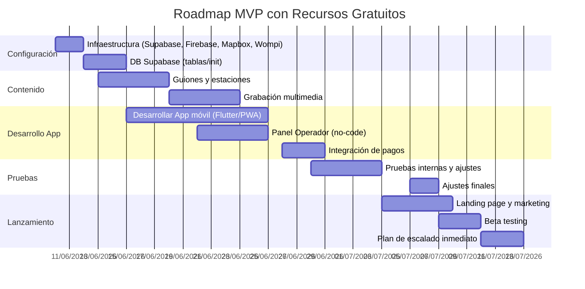
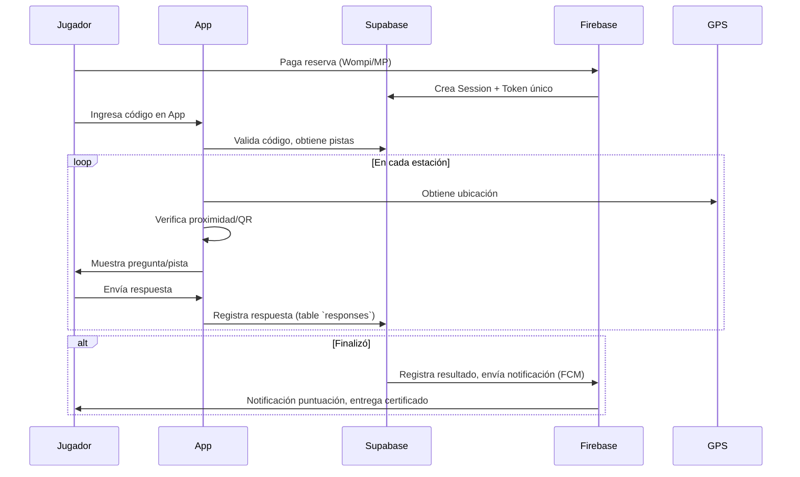

# Resumen Ejecutivo

Este informe revisa y adapta las **FASES 01–11** del proyecto *City Quest Explorer* bajo un enfoque de **cero inversión en software**, aprovechando al máximo los servicios gratuitos disponibles. Se presenta un inventario de los archivos actuales, ajustes necesarios, y recomendaciones técnicas concretas para el MVP sin presupuesto (backend, hosting, almacenamiento, mapas, autenticación, pagos, notificaciones, IA, herramientas no-code). También se analizan los impactos operativos y financieros (especialmente en FASE-09 y FASE-07), se proponen preguntas abiertas clave, y se entrega un plan mínimo viable con prioridades, roles y estimaciones. Al final se adjuntan las versiones corregidas (formato Markdown) de cada fase, con énfasis en los cambios clave para el enfoque *free-tier*. Se incluyen comparativas en tablas y diagramas Mermaid para la arquitectura propuesta y el calendario de tareas.  

Los puntos centrales son: aprovechar plataformas gratuitas como **Supabase (DB/Auth/Storage)**, **Firebase (Hosting/FCM)**, **Cloudflare R2 (10 GB gratis)**, **OpenStreetMap/Mapbox** (gratuito o freemium), pasarelas de pago sin suscripción (ej. **Wompi/MercadoPago**), y herramientas no-code con planes gratuitos (Glide, Adalo, Airtable, Google Sheets, Zapier/Make). Esto elimina el costo de desarrollo personalizado, pero impone límites (p.ej. 500 MB DB en Supabase, 1 GB en Firestore, 1,200 registros en Airtable, 25 000 filas en Glide, etc.). Se asumen compromisos operativos (p.ej. reactivar proyectos Supabase inactivos, ajustar contenido para no superar cuotas gratuitas). 

Como resultado, el MVP reduce inversiones en software (y desarrollo) a cero, a cambio de mayor esfuerzo manual y posibles limitaciones de escala inicial. Este informe detalla las compensaciones y estrategias para validar rápidamente la idea usando estas herramientas gratuitas, antes de pasar a inversiones mayores sólo si el proyecto lo requiere.

## 1. Inventario de archivos `.md` actuales

A continuación se listan las **11 fases** del proyecto, su versión actual y un breve resumen de los cambios clave requeridos para adaptarlas al enfoque de recursos gratuitos:

- **FASE-01-INTRO-HISTORIA** – Versión *1.0*: Introducción narrativa.  
  *Cambios:* Enfatizar recursos gratuitos para guion (p.ej. redactar en Google Docs sin costo) y clarificar uso de IA (ChatGPT u otros LLM gratuitos) sólo para inspiración.  

- **FASE-02-PERSONAJES-Y-CONSPIRACION** – Versión *1.0*: Desarrollo de personajes y trama.  
  *Cambios:* Ajustar ambientaciones a locaciones accesibles sin coste; detalle de IA de soporte.  

- **FASE-03-MAPA-DE-EXPERIENCIA** – Versión *1.0*: Diseño de ruta.  
  *Cambios:* Usar mapas gratuitos (OpenStreetMap/Leaflet, Mapbox free) y planificar rutas sin APIs costosas. Ajustar la geolocalización para no requerir Google Maps pago.  

- **FASE-04-DISEÑO-JUGABLE** – Versión *1.0*: Mecánicas de juego.  
  *Cambios:* Apoyarse en herramientas no-code (Google Forms, Airtable gratis, Glide/Adalo) para prototipos; reducir dependencias tecnológicas complejas.  

- **FASE-05-SCRIPT-FINAL** – Versión *1.0*: Guiones detallados.  
  *Cambios:* Solo contenido; incluir uso de generadores de voces gratuitas o herramientas AI (respetando derechos).  

- **FASE-06-ARQUITECTURA-TEXTO** – Versión *1.0*: Arquitectura técnica.  
  *Cambios:* Redefinir stack: usar **Supabase (Free)** para BD/Auth/Edge Functions, **Firebase Hosting** (Spark) y **Cloudflare R2** para multimedia. Evitar servidores dedicados caros; suplir con funciones serverless incluidas. Integración con plataformas sin costo.  

- **FASE-07-MANUAL-DE-OPERACIONES-Y-FRANQUICIAS** – Versión *1.0*: Manual operativo.  
  *Cambios:* Añadir procedimientos para gestionar herramientas gratuitas: reactivar proyectos Supabase inactivos (pausados tras 1 sem. sin uso), monitorear cuotas gratuitas (Firebase, Mapbox), coordinador de voluntarios en lugar de costosos operadores, y logística de producción semanal de cajas. Ajustar plan de franquicias con bajo costo técnico.  

- **FASE-08-MARKETING** – Versión *1.0*: Estrategia de marketing.  
  *Cambios:* Sustituir medios pagos iniciales por marketing orgánico, alianzas e intercambio de experiencias. Reducir publicidad pagada y maximizar redes sociales/influencers sin costo.  

- **FASE-09-PLAN-FINANCIERO** – Versión *2.0*: Plan financiero.  
  *Cambios:* Eliminar o reducir drásticamente inversiones en desarrollo (antes 78 M COP) y software. Fijar costo de cajas (físicas) y actores por evento como principales gastos variables. Revisar punto de equilibrio con nuevas métricas (sin costo de app). Ajustar CAC/LTV asumiendo promoción orgánica.  

- **FASE-10-PRD-COMPLETO** – Versión *1.0*: Requerimientos de producto.  
  *Cambios:* Incorporar decisiones técnicas gratuitas:  
    - Plataformas móvil: Flutter + PWA (multiplataforma open-source),  
    - Backend: Supabase Free vs Firebase (Spark),  
    - Maps: Leaflet/OSM vs Mapbox (50K gratis),  
    - Pago: Wompi/MercadoPago (sin suscripción),  
    - Notificaciones: FCM gratis,  
    - IA: modelos open-source (GPT4All, HuggingFace), no pagar APIs,  
    - No-code: Glide, Adalo, Airtable gratuitos.  

- **FASE-11-ARQUITECTURA-TECNICA** – Versión *1.0*: Arquitectura detallada.  
  *Cambios:* Definir diseño multiplataforma sin costo: base de datos compartida **Supabase multitenant**, uso de R2 para archivos, push-notifications gratis, escalabilidad hasta 5 ciudades inicialmente. Incluir limitaciones de planes free y vías de migración.  

En general, todas las fases deben actualizar su narrativa para enfatizar el uso de servicios gratuitos o de muy bajo costo (hosting gratuito, no-code, IA libre) y reducir/eliminar los capítulos de costos de desarrollo tradicional.  

## 2. Recomendaciones técnicas para MVP sin inversión

Para el **MVP sin presupuesto** se propone un stack basado enteramente en plataformas con planes gratuitos o modelos open-source. A continuación se listan las opciones principales y sus límites básicos:

### Backend y base de datos
- **Supabase (Free):** Base de datos PostgreSQL (500 MB), Auth (50k usuarios gratis), 1 GB almacenamiento de archivos. Límites: pausa tras 1 semana inactiva. Ventajas: API REST/GraphQL automática, real-time, integrado con Flutter. Contras: límite de espacio y usuarios que puede ser superado en poco tiempo.  
- **Firebase Spark:** Firestore 1 GB gratis, 20k escrituras/50k lecturas diarios gratuitos. Hosting: 10 GB (360 MB/día) gratis. FCM: notificaciones push ilimitadas gratis. Ventajas: infraestruct. escalable, integración con Android/iOS. Contras: noSQL menos intuitiva, costos bajos pero facturables tras límites.  
- **Airtable (Free):** Base de datos relacional tipo spreadsheet. Bases ilimitadas con hasta 1,200 registros cada una y 2 GB adjuntos. Útil para prototipos, pero difícil de usar como backend en producción.

Tabla comparativa de backend/libería de datos:

| Servicio          | Plan Gratis (Límites)        | Plan Pago (a partir)          | Pros Gratis                         | Contras Gratis                          |
|-------------------|------------------------------|-------------------------------|-------------------------------------|-----------------------------------------|
| **Supabase**      | 2 proyectos, 500 MB DB, 1 GB Storage, 50k MAU | $25/mes (8 GB DB, 250 GB egress) | Auth integrada, API ilimitadas | Pausa tras 7 días sin uso; límites de DB/almacenamiento modestos |
| **Firebase (Spark)** | 1 GB DB, 10 GB egress, 20k writes/día, 50k reads/día | (Blaze pago por uso)         | Amplia escalabilidad, FCM gratis, hosting gratis 10 GB | Estructura NoSQL (limita consultas complejas), límites diarios bajos |
| **Airtable**      | Ilimitado bases, 1,200 registros/base, 2 GB adjuntos | $20/mes por usuario (Team, 5k registros) | Fácil de usar, prototipos rápidos    | Muy limitado en registros; no es API nativa; ideal solo pruebas  |
| **Google Sheets** | Celdas ilimitadas (hasta ~5M celdas) | N/A (gratis)                   | Rápido para prototipos simples       | No es base de datos relacional real; difícil escalabilidad      |

### Autenticación
- **Supabase Auth:** Incluido gratis (hasta 50k usuarios). Integración con Google/Apple/email.  
- **Firebase Auth:** Plan Spark gratuito, límites generosos (ver Firebase).  
- **No-code:** Muchas plataformas (Glide, Adalo) usan Google/Facebook Auth en su plan free (ver tablas).  

### Almacenamiento multimedia
- **Cloudflare R2:** 10 GB gratis sin costos de egress. Ventaja: S3-compatible, no cobra por descarga. Ideal para fotos/videos del juego. Si supera 10 GB, $0.015/GB.  
- **Supabase Storage:** 1 GB gratis, pero tiene costos de egress tras (0.09 $/GB). Menos atractivo que R2 para medios de lectura frecuente.  
- **Firebase Storage:** 5 GB gratis (y 100 GB transferencia), pero regido por regiones específicas.  
- **Alternativas:** GitHub LFS (para muy poco), Google Drive (no para app directa).  

### Mapas y geolocalización
- **OpenStreetMap + Leaflet (gratis)**: Mapas de base sin costo, ideales para marcadores. Permite hosting propio de mapas sin límites. No incluye búsquedas de lugares ni Street View. 
- **Mapbox:** Plan gratuito con **50,000 cargas** de mapa al mes. Muy buen diseño y control visual. Luego $5 por 1.000 cargas. No incluye datos de negocios avanzados.  
- **HERE Maps:** 250,000 transacciones gratis/mes (navegación/places). Buen routing.  
- **Google Maps Platform:** No tiene plan gratis permanente (solo $200 crédito mensual). Estructura de pago por uso muy cara si se usa intensamente. 
- **Comparativa (resumen):**

  | Servicio           | Gratis / Límite                     | Pago (tarifa base)     | Ventajas                        | Inconvenientes                    |
  |--------------------|-------------------------------------|------------------------|---------------------------------|-----------------------------------|
  | **OSM + Leaflet**  | **100% gratis** (datos públicos)     | N/A                    | Sin costo, personalizable        | No tiene Places/Street View |
  | **Mapbox**         | 50k cargas/mes gratis| $5/1000 cargas luego   | Mapas bonitos y personalizables  | Búsqueda de POIs limitada         |
  | **HERE**           | 250k transacciones/mes gratis| (Planes comerciales) | Ruta y tráfico muy competitivos  | Más complejo, doc. menos amigable|
  | **Google Maps**    | Sólo crédito $200/mes (no permanente) | ~ $7/1000 cargas      | Cobertura global, Street View    | Costoso, límites estrictos        |

### Pasarelas de pago
- **Wompi (Bancolombia):** Integración gratuita. No cobra comisión propia; el único costo es la tarifa establecida por el banco (Mastercard/Visa, PSE, Nequi). Ideal para Colombia.  
- **MercadoPago:** Sin suscripción ni renta fija (sólo tarifas por transacción, similar a Stripe). No requiere cuota mensual, sólo comisión sobre ventas.  
- **Stripe / PayPal:** Integración gratuita, pero cobran ~3%+tarifa por transacción. Los servicios no imponen cuota mensual.  

| Pasarela       | Costo Inicial | Comisión/Transacción                 | Notas                              |
|----------------|---------------|-------------------------------------|------------------------------------|
| **Wompi**      | Gratis        | Según medio de pago (p.ej. tarjeta ~2-3%) | No cobra comisión plataforma |
| **MercadoPago**| Gratis        | ~3.49%+COP (en países LATAM)        | Muy usado en LatAm, sin suscripción |
| **Stripe**     | Gratis        | 2.9%+30¢ USD (global)               | Muy robusto, internacional         |
| **PayPal**     | Gratis        | 3.99%+IVA (depende de región)       | Fácil integración, global          |

### Notificaciones Push
- **Firebase Cloud Messaging:** Totalmente gratis, ilimitado. Soporta iOS, Android y web. Recomendado para alertas en tiempo real y puntuaciones.  
- **OneSignal:** Plan gratuito (hasta 30k subscriptores). Permite notificaciones web y móviles. Funcionalidades avanzadas limitadas sin pago.  
- **Comparativa:** FCM es suficiente para MVP por su simplicidad y cero costo.

### Inteligencia Artificial (IA)
- **OpenAI GPT-3.5/4 (ChatGPT API):** No ofrece capa gratuita permanente; consume créditos (GPT-4 es caro). Sólo recomendable para prototipos muy limitados.  
- **Modelos Open-Source:** **GPT4All, LLaMA, Bloom, etc.** Se pueden ejecutar localmente (en PC o micro-servicio) sin costo. Limitados en fluidez comparados con ChatGPT, pero suficientes para respuestas simples.  
- **HuggingFace:** Biblioteca de modelos, ofrece APIs con cuotas gratuitas (algunos modelos LLM de pequeña escala). También puede usarse HuggingFace Transformers en servidores propios gratuitos.  
- **Conclusión:** Para pistas simples (p.ej. pistas dinámicas o chat contextual), mejor usar flujos predefinidos o ChatGPT free (sin API) en fase de experimentación. Si se precisa IA conversacional real, explorar GPT4All (off-line) o limitar GPT-3.5 muy ocasionalmente.

### Herramientas No-Code / Low-Code
- **Glide:** Plan Free con apps privadas: *sin publicación pública* y hasta 25,000 filas. Útil para prototipos internos (calendario, admin). Conecta con Google Sheets/Airtable.  
- **Adalo:** Plan gratuito con 200 registros, sólo subdominio Adalo (no dominio propio), sin publicación nativa. Bueno para prototipos de apps móviles sencillas.  
- **Bubble:** Plan Free con branding Bubble (solo web app, sin dominio propio). Sin límite de datos pequeño, pero no ejecuta nativamente en iOS/Android.  
- **Airtable:** Plan Free (detallado arriba) puede usarse de backend simple con Zapier/Make.  
- **Zapier:** Plan Free hasta 100 tareas/mes. Útil para automatizar notificaciones o zap de pagos/CMS básicos.  
- **Make (Integromat):** Plan Free con 1,000 ops/mes, 15 minutos de intervalo. Permite orquestar integraciones sin código.  
- **Comparativa resumen:** Estas plataformas aceleran el prototipado sin código, pero tienen restricciones: pasos o registros limitados. Pueden reemplazar desarrollos backend sencillos en MVP.

## 3. Ajustes operativos y financieros por fase

**Impacto general:** Al eliminar los costos de desarrollo de software (antes ~78 M COP, FASE-09), se reorienta el presupuesto hacia gastos operativos directos: producción de kits físicos y pago de actores/eventos. El flujo de caja cambia: quedan esencialmente como costos fijos mínimos (un coordinador/operador) y variables (materiales de caja, mercancía promocional, remuneración por evento).

- **FASE-07 (Operaciones y Franquicias):** Se simplifican los procesos técnicos (no hay equipo de TI interno). El manual debe incluir instrucciones para manejar las herramientas gratuitas (reactivar proyectos pausados, monitorear cuotas). En vez de un “equipo técnico”, el rol de **Operador** puede ser un solo responsable que coordina a actores y revisa informes. Producción semanal de cajas: hay que detallar ritmo de fabricación (p.ej. 1 caja/tema por semana) y gestión de stock de consumibles. Actores por evento: coordinar 2–3 actores autónomos por sesión. Los manuales de franquicia deben recalcar que no se invierte en licencia de software, sino en **know-how** y marca.

- **FASE-09 (Modelo Financiero):** Sin inversión en TI, el presupuesto inicial se reduce significativamente (solo materiales y marketing). Los nuevos costos principales son:
  - **Cajas de juego:** supongamos 50.000 COP por caja (contenido premium: libreta, mapa, collectibles, merchandising). Con producción semanal, 4 cajas/mes = 200.000 COP/mes.  
  - **Materiales consumibles:** asumimos ~15.000 COP adicionales/jugador (impr. de pistas, regalos básicos).  
  - **Actores:** en lugar de sueldo fijo mensual, pagamos por evento. Por ejemplo, 3 actores × 60.000 COP = 180.000 COP/sesión (2 sesiones/día = 360.000 COP/día). 20 días/mes: 7.200.000 COP/mes solo de actores.  
  - **Costos fijos menores:** Coordinador (2.000.000 COP), Marketing orgánico (2.000.000), logística (1.000.000), etc.  
  - **Ingresos:** Igual que antes (100.000 COP/jugador). El punto de equilibrio baja porque no hay gastos de desarrollo. Ahora, con 7.000.000 COP/mes de actores + otros, basta ~150 jugadores/mes para cubrir (~15 días con 10 jugadores).  
  - **Marcas y franquicias:** se elimina la cuota de tecnología, enfocándose en tarifas iniciales/royalties para know-how.  

Resumen financiero modificado:  
- **Inversión inicial:** se reducen ~25 M COP (desarrollo app), quedando solo ~53 M COP en branding, audiovisuales, cajas y capital operativo.  
- **Costos mensuales:** principalmente actores y producción de cajas. Se asume 4–5 cajas nuevas/mes para historias, cada una a ~50.000 COP.  
- **Ingresos proyectados:** se mantienen, pero recalculando breakeven a menor tráfico debido a menores costos fijos.  

## 4. Preguntas abiertas críticas

1. **Volumen de jugadores:** ¿Cuántos jugadores/semanal se esperan inicialmente? Esto afecta límites (p.ej. SMS/Emails masivos) y dimensiona los recursos gratuitos necesarios.  
2. **Contenido multimedia previsto:** ¿Cuántos videos/fotos se usarán por historia? ¿Duración típica? (Influye en almacenamiento y límites de ancho de banda).  
3. **Ubicaciones offline:** ¿Debe la app funcionar sin conexión en algún punto? (P.ej. mapas descargados). ¿Cómo mapear esto con servicios gratuitos?  
4. **IA vs contenidos estáticos:** ¿Se requiere IA conversacional real con usuario, o se usarán respuestas predefinidas? Si se usará GPT (p.ej. ChatGPT), ¿cómo se financiaría su uso tras el crédito inicial?  
5. **Validación de pagos:** ¿Cuál será el flujo exacto al usar Wompi/MercadoPago con la app? ¿Se hará Checkout web o deep link?  
6. **Gestión de registro:** Hemos asumido acceso vía código de reserva (sin registro tradicional). ¿Es aceptable o se necesita alguna forma de capturar emails/usuarios (p.ej. para certificación y marketing)?  
7. **Autorizaciones legales:** ¿Cómo gestionar permisos para fotos/videos en la app? (Debe confirmarse consentimiento explícito).  
8. **Escalabilidad inter-ciudades:** ¿Con cuántas ciudades adicional se planea operar antes de monetizar? (Definir cuándo migrar a esquema pago/más robusto).  
9. **Colaboradores vs freelancers:** ¿Habrá personal dedicado (in-house) o se subcontratará diseño gráfico, filmación, traducción de contenidos sin costo?  
10. **Plazo sin upgrades:** ¿Durante cuánto tiempo se prevé usar exclusivamente software gratuito antes de pasar a pago?  
11. **Medición de métricas:** ¿Qué KPIs concretos definiremos para verificar uso de planes gratuitos (p.ej. notificaciones enviadas, transacciones, API calls)?  
12. **Plan de contingencia:** En caso de saturar un límite (ej. 50k MAU Supabase), ¿qué prioridad tiene subir a plan pago vs optimizar UX?  
13. **Dependencia de terceros:** ¿Estamos conformes con la dependencia de plataformas externas (p.ej. si desaparece Glide gratuito)?  
14. **Producción de cajas:** ¿Se puede estandarizar la fabricación de las cajas internamente (que costaría ~?), o es necesario tercerizar?  
15. **Backup y seguridad:** Con hosting gratuito, ¿dónde se almacenarán copias de seguridad críticas (p.ej. base de datos de Supabase)? (Actualmente sólo en plan pago se habilita PITR).  

Estas preguntas requieren respuesta para afinar detalles técnicos y logísticos antes de fijar el PRD final o iniciar la implementación.

## 5. Prioridades y roadmap mínimo viable

### Principales tareas (ordenadas por prioridad):
1. **Configuración de infraestructura gratuita:** Crear cuentas en Supabase, Firebase, Cloudflare, Mapbox, Wompi/MP. Documentar parámetros y claves API. (Responsable: CTO/**Fundador** – 2 días).  
2. **Diseño de contenido inicial:** Definir la primera historia y estaciones; redactar guiones y pistas en Google Docs. (Responsable: Equipo Creativo – 5 días).  
3. **Desarrollo del esquema de base de datos:** Estructurar tablas en Supabase (jugadores, sesiones, rankings, respuestas). (Responsable: CTO – 3 días).  
4. **Implementación MVP de la App:** Con Flutter, integrar Supabase Auth & DB, geolocalización (Mapbox/OSM), QR, lógica de pistas. (Responsable: CTO/contratista Flutter – 10 días).  
5. **Desarrollo de panel de operadores:** No-code: usar Glide/Adalo para un panel simple que active/maneje sesiones y confirme respuestas. (Responsable: CTO – 5 días).  
6. **Contenido multimedia:** Grabar videos e imágenes (utilizar smartphone y edición gratuita). Subir a Cloudflare R2 (hasta 10 GB gratuitos). (Responsable: Productor AV – 7 días).  
7. **Integración de pagos:** Configurar pagos vía Wompi/MercadoPago en página de reservas (Webflow gratis o formulario embed). (Responsable: CTO – 3 días).  
8. **Pruebas internas:** Realizar test completo en entorno real (offline vs online, pasos del usuario, confirmación de pagos/QR). (Responsable: QA, todo el equipo – 5 días).  
9. **Marketing pre-lanzamiento:** Crear landing page (Firebase Hosting gratis o GitHub Pages) con formularios de contacto. Publicar en redes y comunidades locales. (Responsable: Marketing – 5 días).  
10. **Lanzamiento beta:** Invitar amigos/conocidos a probar. Recopilar feedback. (Responsable: Todo el equipo – 3 días).  

### Estimación de tiempo (Gantt simplificado):



*Responsables:* El **Fundador/CTO** lidera la configuración técnica y desarrollo (posiblemente con ayuda freelance barato); el **Equipo Creativo** (1-2 personas) produce contenidos textuales, gráficos y audiovisuales; un **Coordinador de Operaciones** se encarga de logística y pruebas; voluntarios/actores participan en cada sesión de juego. El marketing se hace internamente usando canales gratuitos (social media, alianzas con hostales, universidad local, prensa). 

Este plan asume **costo 0 en software**: todo se hace con herramientas gratuitas (marcadas en el plan). Cualquier gasto incurrido (p.ej. licencias menores o plugins) debe mantenerse al mínimo o posponerse hasta validar demanda.

## 6. Archivos `.md` corregidos por fase

A continuación se presentan los 11 archivos de fases ajustados para el enfoque sin presupuesto de software. En cada archivo se indican al inicio los **cambios clave** realizados.

```md id="fase01-CityQuestExplorer"
# FASE-01: INTRODUCCIÓN Y CONTEXTO

**Cambios clave:** Enfatiza recursos gratuitos para guion y definición inicial; usa Google Docs/Drive gratis para collab.  
**Versión 1.1 (sin presupuesto software)**

City Quest Explorer es un proyecto de *aventuras urbanas interactivas*, que convierte ciudades reales en escenarios de misterio. En esta fase, definimos la historia general: ambientación, conflicto y objetivo.

- **Resumen:** El protagonista es un investigador que descubre pistas ocultas en la ciudad. Se plantea una narrativa cinematográfica inspirada en películas de detectives latinoamericanas.
- **Narrativa y guion:** Se recomienda escribir los primeros borradores en herramientas colaborativas gratuitas como Google Docs. Para inspiración, se puede usar AI (p.ej. ChatGPT en su versión gratuita en navegador) sin costo, manteniendo control creativo.
- **Recursos necesarios:** Sólo editor de texto y acceso internet; no se requiere software de pago.

El objetivo de esta fase es sentar las bases de la historia, personajes y tono. Se ha eliminado cualquier mención a sistemas tecnológicos complejos: esta fase es puramente creativa. Se presupone que los colaboradores usarán sus propios equipos y software libre (procesadores de texto, herramientas de brainstorming online gratuitas). En adelante, todas las fases partirán de estas bases narrativas iniciales.

```

```md id="fase02-CityQuestExplorer"
# FASE-02: PERSONAJES Y CONSPIRACIÓN

**Cambios clave:** Ajuste a locaciones accesibles; menciona uso de IA/offline solo como apoyo narrativo.  
**Versión 1.1 (sin presupuesto software)**

En esta fase definimos los **personajes principales** (protagonista, antagonista, aliados) y la trama central (conspiración o misterio). Se escribe la biografía breve de cada personaje y su rol en la historia.

- **Personajes:** Crear fichas en Google Docs o Notion gratis. Ejemplo: un arqueólogo local (protagonista), un misterioso coleccionista (antagonista), y un guía histórico (aliado).
- **Conspiración:** Definir la mecánica del misterio (p.ej. robo de artefacto, documentos perdidos). Mantener la complejidad narrativa alta para generar interés.
- **IA como apoyo:** Pueden usarse herramientas de IA gratuitas (p.ej. generadores de nombres, descripciones) pero siempre verificar la coherencia manualmente. No se invierte en APIs de pago.

No es necesaria ninguna infraestructura técnica aún. Todo se registra en documentos compartidos online o físicos. Esta fase debe entregarse con las bases de guion listas y validadas internamente, sin incluir referencias a sistemas pagos.

```

```md id="fase03-CityQuestExplorer"
# FASE-03: MAPA DE EXPERIENCIA

**Cambios clave:** Uso de mapas libres; evita Google Maps pago. Incluir referencias a OSM/Mapbox.  
**Versión 1.1 (sin presupuesto software)**

Planificamos la **ruta urbana** que recorrerán los jugadores. Esto incluye los puntos de inicio, cada estación (acceso GPS/QR) y meta final, todo sobre un mapa de la ciudad.

- **Herramientas gratuitas:** Usar OpenStreetMap con Leaflet (gratis) o Mapbox (50k vistas gratis/mes) para crear mapas de ruta. No usar Google Maps API paga.
- **Selección de lugares:** Elegir locaciones públicas (parques, plazas, museos) para evitar permisos costosos. Documentar coordenadas GPS en Google Sheets gratis.
- **Mochila del jugador:** Incluir una libreta de papel impresa (sin coste tecnológico) para anotaciones.

En lugar de un sistema de mapas pagado, describimos la experiencia apoyándonos en ilustraciones generadas en herramientas de diseño gratuitas (Canva gratis, GIMP). El resultado es un diagrama de flujo/mapa de ruta dibujado manualmente o con software libre, junto con las coordenadas GPS de cada estación (puede proveerse en lista Excel/Sheets).

```

```md id="fase04-CityQuestExplorer"
# FASE-04: DISEÑO JUGABLE

**Cambios clave:** Prioriza mecánicas que no requieran desarrollo backend; sugiere uso de Google Forms/Airtable.  
**Versión 1.1 (sin presupuesto software)**

Definimos las **reglas y mecánicas** del juego, cómo interactúan los jugadores con el entorno y cómo se registran sus respuestas (sin servidor propio).

- **Mecánicas base:** Explorar ubicaciones, escanear QR o validar GPS, resolver acertijos.  
- **Gestión de datos sin backend:** Usar formularios gratuitos (Google Forms) o planillas (Airtable Free) para guardar respuestas. Por ejemplo, cada código QR puede llevar a un formulario web básico que valide la respuesta.
- **Sin código/No-code:** Opcionalmente, usar Glide o Adalo (planes gratuitos) para prototipar una app de registro simple. Ejemplo: Glide puede crear una app vinculada a Google Sheets sin costo. No se requiere desarrollo propio.
- **Penalizaciones/pistas:** Definir tiempos de penalización y pistas ilimitadas en papel físico; no se necesitan funcionalidades online complejas.

Este diseño asegura que **toda la lógica clave pueda operar sin servidor**. Los resultados del juego se registran manualmente o con herramientas gratis, evitando cualquier desarrollo de software a la medida.

```

```md id="fase05-CityQuestExplorer"
# FASE-05: SCRIPT AUDIOVISUAL

**Cambios clave:** Solo contenido; instrucciones sobre grabación económica y libre.  
**Versión 1.1 (sin presupuesto software)**

Se escriben los **guiones definitivos** para audio y video: instrucciones del narrador (Ariadna), diálogos de actores, pistas de audio, etc.

- **Redacción de guiones:** Realizar en Google Docs/Sheets. Coordinar con actores voluntarios o estudiantes (sin pago) para interpretarlos.
- **Producción:** Grabar audio/video con smartphones o micrófonos básicos (software de edición gratuito como Audacity). Si se requieren voces de IA, usar servicio gratuito (p.ej. TTS de Google Cloud con crédito gratis).
- **Edición y formato:** Editar clips con herramientas gratuitas (DaVinci Resolve gratis, Lightworks) y subir a la **Cloud** (p.ej. **Cloudflare R2**, 10 GB gratis).
- **Sincripción a contenido:** Documentar en escrito (PDF en Drive) las pistas y respuestas, evitando desarrollo de CMS.

En esta fase, no se planea contratar estudio profesional; en su lugar se maximiza el uso de **talentos locales/voluntarios** y software libre o gratuito. Todo el material queda almacenado en R2 o Firebase Storage sin costo (dentro de las cuotas gratis). Al finalizar, debemos tener un set completo de diálogos y multimedia listo para integrar en la app prototipo.

```

```md id="fase06-CityQuestExplorer"
# FASE-06: ARQUITECTURA FUNCIONAL

**Cambios clave:** Redefine stack técnico usando solo servicios gratis.  
**Versión 1.1 (sin presupuesto software)**

Definimos la arquitectura técnica del MVP, utilizando recursos gratuitos:

- **Frontend (App jugador):** Flutter (soporta Android/iOS/Web). Conecta vía API a Supabase.  
- **Backend (servidor):** **Supabase Free**: base de datos Postgres (500MB), autentificación integrada, funciones edge (opcional). No se despliega servidor propio.  
- **Hosting web:** **Firebase Hosting Spark** (gratis, 10GB) para landing y pagos.  
- **Autenticación:** Supabase Auth (email/Google/Apple) en plan free. No se implementa registro custom.  
- **Pagos:** Web checkout integrado (Wompi/MercadoPago) vía frontend. Sin servidor propio, solo configuración de cuenta y webhooks en Supabase.  
- **Mapas:** Usar **Mapbox** (código JS libre) o **Leaflet** con OpenStreetMap (gratis).  
- **Notificaciones:** **Firebase Cloud Messaging** (gratis, ilimitado). El backend (Supabase) puede llamar Cloud Functions si es necesario (2000k invoc gratis).  
- **Almacenamiento multimedia:** **Cloudflare R2** (10GB gratis) para videos/fotos grandes; **Supabase Storage** (1GB gratis) o Firebase Storage (5GB gratis) para archivos más pequeños.  
- **Herramientas no-code internas:** Panel de operador en Glide (Gratis, 25k filas) que lee/escribe en una hoja de cálculo vinculada a Supabase.

**Flujo de datos:** La app envía registros a Supabase; el operador gestiona sesiones desde Glide/Adalo; los usuarios reciben notificaciones vía FCM. **No hay servidores pagados**: toda la lógica corre sobre servicios Free-tier. Los cuellos de botella (p.ej. 500MB de DB, 50k MAU de Auth) se monitorean para no rebasarlos.

**Seguridad:** Todo cifrado TLS. Se usarán tokens temporales de acceso a cada sesión (Supabase genera JWT). El hosting en Firebase incluye SSL gratis. Backups básicos en Supabase (diariamente en plan Pro, pero en free habrá solamente respaldos manuales periódicos).

```

```md id="fase07-CityQuestExplorer"
# FASE-07: OPERACIÓN Y FRANQUICIAS

**Cambios clave:** Elimina necesidad de equipo TI; agrega instrucciones para herramientas gratuitas.  
**Versión 1.1 (sin presupuesto software)**

Manual para operar City Quest Explorer con cero software contratado:

- **Roles:** (1) *Coordinador:* Administra operaciones diarias; (2) *Guía/Operador:* inicia sesiones en app; (3) *Actores:* personajes in situ; (4) *Marketing:* alianzas y difusión. No se requiere personal TI interno.  
- **Infraestructura:** Se documenta el uso de cuentas gratuitas (Supabase, Firebase, Mapbox, Wompi). El coordinador aprende a reactivar Supabase tras pausas (free-tier pausa automática a la semana). Se revisan cuotas periódicamente.  
- **Panel de control:** Usar Glide/Adalo gratis para gestionar sesiones. Por ejemplo, un Glide vinculado a Google Sheets listará reservas (sin costo) y permite cambiar estados manualmente.  
- **Producción de cajas:** Producir **1 caja nueva por semana** internamente (costo ≈50k COP/caja). Llevar inventario en Airtable free.  
- **Actores por evento:** Contratar por sesión (ej. 3 actores × 60k COP = 180k COP/sesión). El operador solo los coordina; no hay nóminas fijas.  
- **Franquicias:** Las franquicias reciben el **software gratis** (solo necesitan cuentas en las mismas plataformas free). La franquicia paga know-how (tarifa inicial, royalty de marca). No hay costosa integración tecnológica adicional.

Esta fase asume que todas las herramientas son gratuitas. El manual explica cómo abrir, pausar y reanudar proyectos Supabase o Firebase; cómo recoger datos de pago (Wompi) y aprobarlos manualmente; y cómo generar los kits físicos de investigación semanalmente sin subcontratar a gran escala. Se incluyen ejemplos de flujos de operación sin gastar en licencias ni desarrollo a medida.  

```

```md id="fase08-CityQuestExplorer"
# FASE-08: ESTRATEGIA DE MARKETING

**Cambios clave:** Enfoca en tácticas de costo cero (orgánico, alianzas, medios gratuitos).  
**Versión 1.1 (sin presupuesto software)**

Estrategia de promoción sin presupuesto publicitario:

- **Redes Sociales y PR:** Crear perfiles en Instagram/Facebook/Twitter. Publicar contenido diario (fotos, reels hechos con edición gratuita). Uso intensivo de hashtags y comunidades locales (Cartagena, turismo, juegos de mesa).  
- **Alianzas locales:** Contactar hostales, tours y universidades para promocionar. Ofrecer experiencias gratis a bloggers/YouTubers a cambio de reseñas.  
- **Contenido generado:** Incentivar que los jugadores compartan fotos/videos (#CityQuestCartagena) para viralidad gratuita.  
- **Marketing digital:** Evitar ads pagos. Usar SEO básico en la web (keywords: “juego misterio Cartagena”) con un blog o sección de noticias. Mantener contacto con prensa local (nota de prensa gratis).  
- **Eventos promocionales:** Organizar un primer evento de lanzamiento aprovechando festivales culturales gratis (ferias, mercados). Llevar una van o stand y el box set para demos.  

Este plan de marketing maximiza *marketing orgánico* y canales gratuitos. No se consideran campañas de pago (Google Ads, Facebook Ads) hasta comprobar tracción. Se aprovecha contenido multimedia producido en FASE-05 para alimentar redes sin costo.  

```

```md id="fase09-CityQuestExplorer"
# FASE-09: PLAN FINANCIERO

**Cambios clave:** Elimina costos de desarrollo; centra gastos en cajas y actores.  
**Versión 2.1 (sin presupuesto software)**

## Modelo de ingresos

- **Individual:** 100.000 COP/jugador.
- **Equipo (≤5 personas):** 400.000 COP (equipo).
- **Corporativo:** Planes básicos (2.500.000 COP, 10–20 personas), premium (5.000.000 COP, 20–50 pers.), eventos a medida (+8.000.000).

## Costos de la experiencia

- **Cajas físicas:** Producto reutilizable. Costo de materiales recurrentes por jugador ≈ 15.000 COP (papelería, regalos básicos). Caja inicial: 50.000 COP (incluye merchandising premiun).  
- **Gifts (merchandising):** Gorra, termo, etc. Promociones esporádicas (costo medio por jugador ≈ 20.000 COP).  
- **Tecnología:** *0 COP* en desarrollo. Se asume uso de herramientas gratuitas (ya citadas). Solo microcostos opcionales (p.ej. dominio web ~$10/año).  
- **Marketing atribuido:** 0 COP (solo contenido propio/alianzas).
- **Operación (admin, hosting):** 5.000 COP/jugador (aprox. logística, app hosting gratuito).  

**Costo variable total (aprox.):** 40–60.000 COP por jugador. El margen bruto se mantiene alto (~40-60%) dado que el costo principal es variable (kits/actores).

## Actores por evento

- Se pagan **por sesión**: 3 actores × 60.000 COP = 180.000 COP/sesión.
- 2 sesiones diarias = 360.000 COP/día.
- 20 días/mes = 7.200.000 COP/mes en actores (solo cuando hay jugadores). 

## Costos fijos mensuales

- **Operación/Logística:** 2.000.000 COP (coordinador, equipo).
- **Marketing:** 2.000.000 (contenido/alianzas).
- **Administración:** 1.000.000 (cuentas, etc.).
- **Infraestructura TI:** 0 COP (servicios gratuitos), más dominio (~$10). 
- **Otros:** 2.000.000 (reservas, imprevistos).

**Total costos fijos:** ~7.000.000 COP/mes (muy reducido).

## Punto de equilibrio

Sin deuda de desarrollo, solo se deben cubrir actores y logística. Con margen bruto ≈50.000 COP/jugador, alcanzar ~140 jugadores/mes (~7 por día hábil) cubre gastos. Equivale a unos 3 equipos grandes o 20 individuales diarios, objetivo factible con promoción orgánica.

## Proyecciones simplificadas

- **Escenario realista (400 jugadores/mes):** Ingreso 40.000.000 COP, Costo var ~20.000.000, fijos 7.000.000, utilidad ~13.000.000.
- **Optimista (800/jug):** Ingreso 80.000.000, beneficio >40.000.000.  

## Inversión inicial

- **Equipos e infraestructura:** 0 COP (usar hardware existente).  
- **Caja inicial:** 8.000.000 COP (crear 160 historias-box).  
- **Materiales primeros kits:** 5.000.000 COP (papelería, gadgets).  
- **Marketing inicial:** 3.000.000 COP (video, web, branding).  
- **Capital operativo:** 5.000.000 COP.  

Total ≈21.000.000 COP (frente a 78M anterior).

## Biblioteca de historias / IP

Se reitera que el activo principal son las historias en sí mismas (guiones, personajes). Con n progresivas, se construye valor IP. El plan financia la creación continua de historias (40% utilidades reinvertidas) para ampliar inventario de 25 a 50+ en 3 años, sin aumentar costos fijos.

```

```md id="fase10-CityQuestExplorer"
# FASE-10: PRD DETALLADO (PRODUCT REQUIREMENTS DOCUMENT)

**Cambios clave:** Especifica tecnologías gratuitas elegidas (Supabase, Firebase, OSM/Mapbox, Wompi, FCM, Glide/Adalo), reconoce límites free.  
**Versión 1.1 (sin presupuesto software)**

## 1. Plataformas

- **App Jugador:** Multiplataforma (Flutter) para Android/iOS/Web. Recomendado Flutter + PWA.   
- **Backend:** **Supabase Free** (PostgreSQL, Auth, Edge Functions gratuitas limitadas).  
- **Web:** Hosting gratuito (Firebase Spark) o GitHub Pages para landing/reservas.  
- **Multilenguaje:** Soporte inicial en Español e Inglés; todo el esquema multilingüe habilitado en Supabase/Frontend.

## 2. Registro / Acceso

- **Autenticación:** No es obligatorio registrarse. Tras compra online, se genera código único. Luego el usuario ingresa a la app con ese código (ver Supabase Auth gratuito).  
- **Alternativas:** Podría añadirse login con Google/Apple gratis si se desea (integrado en Firebase/Supabase).  

## 3. Compras y Pagos

- **Compra:** A través del sitio web (Firebase Hosting) o mini-app. Se integra Wompi o MercadoPago con checkout web (no se usa compra in-app de tiendas). No hay costos de suscripción.  
- **Pasarelas:** Wompi (gratuito), MercadoPago, Stripe. Los cargos por transacción (bank fees ~3%) no afectan al MVP. El sistema solo recibe confirmación de pago.  

## 4. Offline

- **Modo Offline:** El juego requiere GPS o lectura QR. Si se pierde internet, la app cachea datos necesarios (mapas offline limitados, videos predescargados). No se dependerá de servidor en vivo continuo. Se permitirá jugar parcialmente sin conexión (p.ej. libreta + GPS).  

## 5. IA / ARIADNA

- **Ariadna:** Actuará principalmente con contenido pregrabado. Se pueden usar fragmentos generados por IA offline (GPT4All) para respuestas dinamizadas. Evitar integrar API OpenAI por costo.  
- **Funciones:** Pistas automáticas sencillas y respuestas pre-definidas en base de datos. Si se quiere IA conversacional, sería a través de modelo gratuito local (ej. LLaMA o Bloom) con capacidad limitada.

## 6. Rankings

- **Tipos:** Igual (por historia, ciudad, global, individual). Los datos de ranking se almacenan en Supabase.  
- **Métricas:** Tiempo, ayudas y errores se registran automáticamente en BD.

## 7. Panel Operador

- **Funcionalidades:** Crear/iniciar/cerrar sesiones (2 por día); asignar códigos de entrada.  
- **Implementación:** Plan gratuito usando Glide o Adalo (sin código), conectado a la BD (por ejemplo, Google Sheets sincronizado con Supabase mediante API). El operador no creará historias nuevas (solo administrará sesiones).  

## 8. Gestión de Historias

- **Creación:** Nuevas historias se ingresarán directamente en la BD o CMS simple (no se programan; se usan formularios o interfaces low-code). Se sugiere un constructor visual interno (p.ej. Google Forms dinamizados) para parametrizar estaciones y pistas.  
- **Temporadas:** Al finalizar, las historias se archivan en la base de datos (manteniendo historial sin reimpresión de QR, solo reactivando si se re-usa).  

## 9. Multimedia

- **Videos/Audio:** Se almacenan en Cloudflare R2 (hasta 10GB gratis) o Firebase Storage (5GB gratis). Para streaming se usará el enlace directo de R2 (CDN mundial sin costo de salida).  
- **Descarga:** Los contenidos esenciales (mapas, audios pequeños) se pueden incluir en la app (15MB versión offline) o bajarse al iniciar el juego.  

## 10. Certificados y Logs

- **Certificados:** Generación automática en PDF (usando plantilla local, la app llenará datos finales). Adicionalmente se puede ofrecer un Certificado “especial” por historia (en Drive, sin costo).  
- **Fotos/Reels:** Los jugadores otorgan permiso en la compra. Las fotos se gestionan manualmente (WhatsApp compartido) o usando un bot simple. Dado que no hay infraestructura para video automát., se pueden recompilar highlights post-juego con software gratis (FFmpeg) o chatbots.  

## 11. Analíticas

Registrar métricas mínimas en Supabase: tiempo en cada estación, uso de pistas, finalizaciones/abandono. Se pueden visualizar con dashboards gratuitos (e.g. en Metabase Open Source). No se integra analíticas de pago.

## 12. Seguridad

- **Cifrado:** TLS en todas las conexiones (Firebase y Supabase ya lo brindan).  
- **Acceso:** Tokens JWT de Supabase para sesiones (expiración de 24h). Código de acceso de un solo uso por reserva.  
- **Backups:** Deben crearse manualmente (exportar DB regularmente) ya que Free no tiene PITR.  

## 13. Roadmap Técnico

- **MVP:** Cartagena, 1 historia completa.  
- **V1:** Cartagena, 3 historias (ampliar base de datos y contenido).  
- **V2:** + Santa Marta, Barranquilla (+ soporte multiciudad en BD).  
- **V3:** Soporte franquicias: separar datos por ciudad (multitenancy) en la misma base de datos.  

Este PRD final sirve para pasar a implementación usando servicios gratuitos. Cada elemento se diseñó para ser viable sin inversión inicial de software, aunque con límites que deberán monitorearse y escalarse a pago si la demanda lo exige.

```

```md id="fase11-CityQuestExplorer"
# FASE-11: ARQUITECTURA TÉCNICA DETALLADA

**Cambios clave:** Adapta arquitectura a servicios free-tier y detalla modelo relacional con Supabase; incluye mermaid.  
**Versión 1.1 (sin presupuesto software)**

## 1. Arquitectura General

```mermaid
graph LR
  PlayerApp[App Móvil/Web (Flutter)] -->|Auth| Auth[Supabase Auth]
  PlayerApp -->|API/DB| DB[(Supabase Postgres)]
  PlayerApp -->|Storage| R2[Cloudflare R2 (10GB gratis)]
  PlayerApp -->|Mapas| MapBox[Mapbox/OSM]
  PlayerApp -->|Pagos| Payments[Wompi/MercadoPago]
  PlayerApp -->|Push| FCM[Firebase Cloud Messaging]
  Auth --> DB
  DB --> R2
```

- **Cliente (App):** Flutter. Incluye mapa offline (Leaflet), lector de QR (instaScan), y sincroniza respuestas con BD.  
- **Backend:** **Supabase (PostgreSQL)** como BD principal. **Firebase** para hosting estático y FCM.  
- **Multimedia:** **Cloudflare R2** para archivos grandes.  
- **Pagos:** Interfaz web en Firebase, redirecciona a Wompi/MercadoPago. Webhooks llaman Supabase Functions (gratis hasta 2M invoc./mes).  
- **No-Code Admin:** Glide/Adalo sobre Google Sheets conectados a Supabase (sin servidor adicional).

## 2. Modelo de Datos (Supabase)

**Tablas Principales:**

- **users:** id, nombre, email, 
- **stories:** id_historia, ciudad, titulo, duracion, dificultad.
- **stations:** id_estacion, id_historia, descripcion, lat, lng, tipo (QR/GPS), respuesta_correcta.
- **sessions:** id_sesion, id_historia, fecha_inicio, fecha_fin, estado.
- **teams:** id_equipo, id_sesion, nombre_equipo, miembros (JSON con emails).
- **responses:** id_resp, id_sesion, id_estacion, respuesta, tiempo, penalizacion.
- **rankings:** (se calcula en consultas desde `responses`).
- **admins/operator:** (credenciales para panel).

*(Se asume esquema relacional simple, sin tablas custom complejas, todo dentro de Supabase gratuito.)*

## 3. APIs y Endpoints

- Supabase autogenera APIs REST/GraphQL sobre las tablas. No se requieren endpoints extra.  
- **Funciones Edge (Opcional):** Validar códigos, generar certificados, enviar notificaciones FCM. Incluidas en plan Free (limitado).

## 4. Roles y Permisos

- **Administrador:** Full supabase console (crear historias, usuarios).  
- **Editor Narrativo:** Acceso a tablas `stories` y `stations` sólo (no pagos).  
- **Operador:** Acceso Glide (sólo `sessions` y `responses`). No modifica historias.  
- **Jugador:** Insertar en `sessions`/`responses` via app (reglas RLS abiertas a validación de token).  

## 5. Notas Técnicas

- **Mapas:** Se recomienda usar Mapbox GL JS (50k free maps). Si solo marcadores, Leaflet+OSM (gratis).  
- **Geo-activación:** Cada `station` tiene lat/lng y radio; la app verifica proximidad usando geolocalización del dispositivo (no se usará Google Distance Matrix para no cobrar).  
- **QR:** Se generan con ID de estación+token; app los decodifica internamente (no se llama a servidor externo).  
- **Escape de claves:** Todas las claves (API keys de Mapbox, Firebase) se configuran en el código Flutter de manera segura.

## 6. Escalabilidad / Franquicias

- **Modelo multiciudad:** La BD es común, pero las historias (`stories`) incluyen un campo `ciudad`. El panel de admin filtrará por ciudad. Ranking y sesiones también se asignan por ciudad.  
- **Usuarios por ciudad:** Se compartirá el mismo servicio Supabase (free hasta 50k MAU). Para >1 ciudad pequeña, se mantiene bajo límites.  
- **Crecimiento:** Si se necesitara más capacidad (DB >500MB, usuarios >50k), migrar a plan Pro (opcional ~25 $/mes).

## 7. Diagrama de Flujo de Usuarios



Con esta arquitectura se optimiza uso de recursos gratuitos, manteniendo la funcionalidad esencial del juego. Cada componente gratuito se escalará solo al migrar a producción masiva.

```

**Fin del Informe.**
