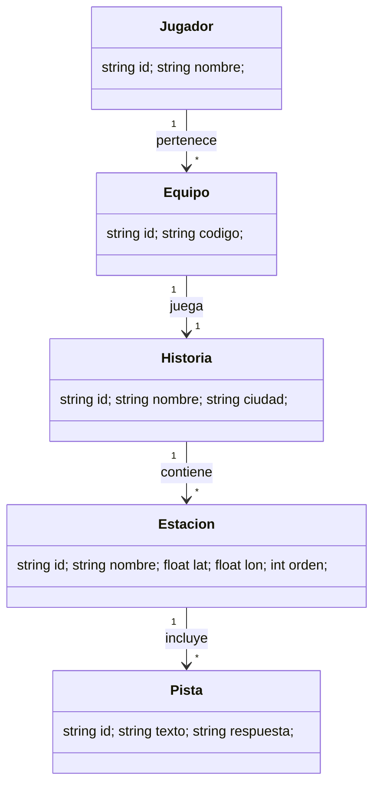

# Resumen Ejecutivo

City Quest Explorer es una experiencia inmersiva que convierte ciudades reales en escenarios de misterio. Hemos revisado las Fases 1–10 originales e incorporado las decisiones clave recientes: precio individual de **100.000 COP**, equipos (hasta 5 personas) **400.000 COP**, código de acceso generado en el sitio web tras la compra, soporte multi-idioma (español/inglés) desde el inicio, actores contratados por sesión, caja de investigación producida internamente **semanalmente**, y uso máximo de servicios gratuitos de software. Para el MVP se emplearán Flutter (app Android/iOS), Supabase (backend y BD gratuita), Cloudflare R2 (almacenamiento gratuito), Google Maps (gratuito hasta 40k llamadas/mes) y pasarelas de pago locales (Wompi, Nequi, Daviplata, tarjetas, PayPal). La arquitectura contempla una App móvil (y futura PWA) que opera offline parcialmente (mediante Service Workers), comunicándose con Supabase y APIs externas. 

**Cambios principales en supuestos:** precio mucho mayor (100k vs 25k), registro vía código web (no login social), producción de cajas semanal interna (no outsourcing caro), actores pagados por evento, uso de Flutter + PWA, base de datos compartida multi-ciudad (5 ciudades iniciales), uso intensivo de infraestructuras gratuitas (Supabase free tier, Cloudflare R2 free tier, etc.). Estos cambios refuerzan la viabilidad con presupuesto de software = 0.

# FASE-01-INTRODUCCIÓN-Y-PROPUESTA.DE.VALOR.md

**Versión:** 2.0 (actualizado para recursos cero)  
**Estado:** Concepto y Validación

**Objetivo:** Definir el concepto, misión, visión y propuesta de valor; segmentar clientes; establecer ventajas competitivas; iniciar presencia digital mínima usando herramientas gratuitas.

## Concepto y Filosofía  
City Quest Explorer transforma una ciudad en una *película interactiva de misterio*. Filosofía:  
- **No vendemos tours:** brindamos aventuras narrativas inmersivas.  
- **No vendemos acertijos:** creamos experiencias cinematográficas vivas.  
- **Manifiesto:** “Cada ciudad esconde secretos. Y tú puedes ayudarnos a resolverlos.”  

## Propuesta de valor  
> “Vive una película de misterio en las calles de Cartagena”.  
Producto: juego de rol urbano con app móvil, personajes reales y tecnología, todo en un recorrido gamificado.  

## Segmentación de usuarios  
- *Turistas nacionales/internacionales:* actividad nocturna diferencial.  
- *Universitarios y grupos de amigos:* buscan ocio original y aventura.  
- *Familias (12+ años):* alternativa segura e interactiva.  
- *Empresas:* team building experiencial.  
- *Jugadores de escape rooms:* buscando mayor escala.  

## Competencia y Diferenciación  
Principales alternativas: tours guiados convencionales, escape rooms tradicionales, y juegos de móvil. Diferenciador clave: **narrativa original + interacción real** combinada con tecnología. La conexión emocional y el uso de actores reales son difíciles de replicar.  

## Presencia digital (low-cost)  
- **Sitio web estático:** usando GitHub Pages (gratuito) con información general.  
- **Formulario de reserva:** Google Forms (gratuito) o Typeform free para capturar leads.  
- **Email/Comunicación:** cuentas de Gmail gratuitas, notificaciones vía WhatsApp Business (gratuito hasta cierto nivel).  
- **Redes Sociales:** Instagram/TikTok gratuitas para difusión.  

## Recursos gratuitos sugeridos  
- **Backend:** usar Supabase Free (500 MB BD, 1 GB almacenamiento, 50K usuarios) para manejo de datos y autenticación.  
- **Autenticación:** código generado en web (no usar OAuth complejo, para evitar costos).  
- **Mapas:** Google Maps gratuito (40K cargas/mes) para geolocalización.  
- **App:** Flutter (open-source, multiplataforma) para iOS/Android, con futura PWA.  
- **Almacenamiento multimedia:** Cloudflare R2 (10 GB gratis/mes) para guardar imágenes, audios y videos.  
- **Mensajería:** Telegram/WhatsApp para alertas de equipo (gratis).  

## Next Steps (Pasos Inmediatos)  
- [ ] Validar concepto con focus group o encuesta (Google Forms).  
- [ ] Registrar dominio gratuito (.tech o .online) y publicar página inicial.  
- [ ] Crear perfiles de redes sociales (Instagram, TikTok) y producir contenido teaser (smartphone).  
- [ ] Abrir proyecto Supabase gratuito y configurar estructura de BD inicial (ciudades, historias).  
- [ ] Planificar primera historia y prototipo de caja de investigador (diseño en Canva, impresión propia).  

## Recursos Mínimos  
- **Equipo:** 2-3 fundadores (1 experto en desarrollo, 1 en narrativa, 1 en marketing).  
- **Materiales semanales:** papel, impresora, cinta, pegamento (para caja física).  
- **Servicios gratis:** GitHub Pages, Supabase Free, Cloudflare R2 Free, Google Maps Free Tier, Canva Free.  

## Unit Economics (Resumen)  
| Concepto          | Valor aproximado |
|------------------|------------------|
| Precio jugador    | 100.000 COP      |
| Costo variable/jugador (m\u00e1teriales, tech, gifts) | ~52.000 COP |
| Margen bruto      | ~48% (~48.000 COP) |
| Jugadores pto. equilibrio /mes | ~270 (8-9 diarios)  |

# FASE-02-ANÁLISIS-DE-MERCADO-Y-COMPETENCIA.md

**Versión:** 2.0  
**Estado:** Investigación de Mercado

**Objetivo:** Investigar demanda potencial, analizar competencia y tendencias turísticas, definir estrategias de precios y posicionamiento de bajo costo.

## Mercado meta y demanda  
- **Turismo:** Cartagena recibe >2 millones de visitantes anuales (DOT local), con alto flujo nocturno en temporada alta. Muchos buscan actividades novedosas.  
- **Ocio local:** Escasean alternativas interactivas tecnológicas en el mercado actual.  
- **Tendencias:** Crecimiento de turismo experiencial post-pandemia. Generación de contenido en RRSS impulsa juegos urbanos interactivos.

## Análisis competitivo  
- **Tours tradicionales:** (guías históricos, recorridos). Precios ~50.000–80.000 COP; carácter pasivo, sin tecnología interactiva.  
- **Escape rooms:** Físicos en la ciudad; precios ~60.000 COP/pers, pero limitados a salas cerradas.  
- **Juegos móviles geolocalizados:** (p.ej. Actionbound); pocos basados en actores reales.  
- **Puntos débiles de competidores:** poca inmersión real, falta de narrativa profunda.  
- **Ventaja CQE:** historia original con actores, tech e IA. Diferenciación clara.

## Clientes y personas  
- **Persona viajero:** “Maria”, 28, turista nacional, busca experiencias únicas al visitar. Invierten ~$20.000 COP en souvenir/artesanías fácilmente.  
- **Persona local joven:** “Carlos”, 22, estudiante, busca planes nocturnos con amigos, dispuesto a gastar $30k–$40k COP en ocio semanal.  

## Estrategia de precios  
- Competitivo con experiencias premium: 100.000 COP por jugador (5–10 veces el tour promedio) refleja calidad cinematográfica. Los equipos (máx 5) pagan 400.000 COP total, incentivando compartir.  
- Ofrecer paquetes corporativos (RSE/TB) con precios basados en beneficios grupales.

## Herramientas y free-tier  
- **Datos de turismo:** usar fuentes gratis (DANE, Ministerio de Comercio).  
- **Encuestas/RR.SS:** Google Forms (gratis) para validar interés.  
- **Analítica web gratuita:** Google Analytics (gratis) en sitio web.  
- **Inteligencia libre:** ChatGPT gratuito (limitado) para generar ideas de benchmarking.

## Next Steps  
- [ ] Realizar encuestas online (Google Forms) a visitantes sobre interés en juegos urbanos.  
- [ ] Contactar foros y comunidades (Reddit/r/travel, TripAdvisor) para insight.  
- [ ] Analizar precios de tours/escape rooms (webs públicas).  
- [ ] Elaborar perfil detallado de “cliente ideal” con datos sociodemográficos.  

## Recursos Mínimos  
- **Equipo:** 1 analista (o voluntario), 1 community manager.  
- **Herramientas:** Google Analytics (gratis), Google Forms (gratis), Google Trends (gratis).  
- **Servicios:** acceso internet. No requiere costos adicionales.

## Unit Economics (Resumen)  
| Concepto            | Valor      |
|--------------------|------------|
| Precio jugador      | 100.000 COP |
| Costo variable/jugador | ~52.000 COP |
| Margen bruto        | ~48% (48.000 COP) |
| Jugadores breakeven/mes | ~270        |

# FASE-03-MAPA-DE-EXPERIENCIA.md

**Versión:** 2.0  
**Estado:** Diseño de Experiencia

**Objetivo:** Mapear el recorrido físico y narrativo de la experiencia (Historia 1: “El Manuscrito Prohibido”). Incorporar estaciones, uso de GPS/QR/IA/actores, flujo emocional y viralización, optimizando para recursos mínimos.

## Recorrido Físico  
- **Localización:** Cartagena Centro y Getsemaní (zona Segovia): límites entre Murallas, Torre del Reloj, San Pedro Claver, Camellón de los Mártires, Getsemaní, Apolo, San Felipe.  
- **Ruta:** 12 estaciones, de las cuales 10 se reutilizan en cada historia para ahorrar costos, con 2 estaciones exclusivas nuevas por lanzamiento. Se diseñan dos rutas (A/B) misma longitud para grupos concurrentes.

## Flujo Narrativo  
- **Introducción (Curiosidad):** Recibimiento con caja de investigador; carta inicial y QR activan la historia.  
- **Descubrimiento (Sorpresa):** Primeras pistas con pruebas sencillas (códigos QR, GPS).  
- **Escalada (Urgencia):** Problema aparece (actor 1: “El Mensajero” crea tensión).  
- **Crisis:** Falsa pista y acto sorprendente hacen creer que el manuscrito se perdió.  
- **Revelación (Asombro):** Actor 3 (“El Custodio”) aparece con la verdad.  
- **Clímax/Final (Victoria):** Hallazgo del manuscrito, celebración.  
- **Postcréditos:** Video breve mostrando momentos destacados, figura misteriosa observando el final.

## Interacciones y tecnología  
- **GPS:** Cada estación tiene coordenadas con radio ~20 m para activar contenido en la app.  
- **QR dinámicos:** QR impresos en locaciones clave (códigos vinculados a contenidos en el backend, pueden reasignarse si cambia la historia).  
- **Caja de investigador:** reutilizable; con objetos base (carta, mapa, libreta, lupa, tarjetas). Consumibles únicos (pistas impresas, pegatinas) se renuevan cada historia.  
- **LIBRETA:** 1 página por estación, combinando espacio para notas con pistas visuales (mapa, cifrados). Algunas páginas “dañadas” para realismo.  
- **Actores (3):** El Mensajero (entrega pistas en la calle), El Vigilante (complicaciones), El Custodio (final con revelación). Contratados por sesión.  
- **ARIADNA (IA):** Narradora virtual en app. Sistema híbrido: sus respuestas críticas son pregrabadas/controladas, mientras que pistas adicionales pueden generarse con IA (ChatGPT) según contexto, manteniendo coherencia.  
- **Offline parcial:** La app permite operar sin conexión internet continua. Mediante Service Workers se cachean contenidos básicos (mapa estático de la ciudad, textos); funciones online (subir respuestas, IA, pagos) requieren conexión.  

## Momento Viral  
En Camellón de los Mártires: QR inútil + actor sorpresa (“Llegaron demasiado tarde”). ARIADNA alerta “No lo sigan”. Crea un “tremendo cliffhanger” visualizable en video corto.

## Operación (MVP low-cost)  
- **Roles:** 1 Operador (registro y monitoreo remoto), 3 Actores freelance por turno.  
- **Montaje:** App Flutter instalada en smartphones prestados o de jugadores. No se requieren guías extras; ARIADNA brinda instrucciones.  
- **Seguridad:** Usar espacios públicos oficiales; no entrar a privadas.  
- **Offline:** La experiencia sigue si se cae la red (modo caché limitado).  

## Next Steps  
- [ ] Ajustar detalles de historia para ciudades futuras (plataforma de gestión de historias bajo Supabase).  
- [ ] Diseñar y probar 12 páginas de libreta + pistas interactivas en Flutter.  
- [ ] Entrenar actores en improvisación y guion breve (8h mínimo).  
- [ ] Configurar los 12 QR en backend Supabase (códigos asociados a estaciones).  

## Recursos Mínimos  
- **Equipo:** 1 operador, 3 actores voluntarios/contratados por partida.  
- **Materiales semanales:** libreta, papel impreso (pistas), cinta/pegamento.  
- **Tecnología:** App Flutter instalada (sin costo), Supabase Free, Google Maps SDK (gratuito hasta cuotas iniciales), generador de QR (libre).  

## Unit Economics (Resumen)  
| Concepto          | Valor      |
|------------------|------------|
| Precio jugador    | 100.000 COP |
| Costo variable/jugador | ~52.000 COP |
| Margen bruto      | ~48% (48.000 COP) |
| Jugadores breakeven/mes | ~270        |

# FASE-04-DISEÑO-INTERACCIÓN-Y-REGLAS.md

**Versión:** 2.0  
**Estado:** Diseño de Juego

**Objetivo:** Definir reglas del juego, mecanismos de registro/acceso, flujos de interacción en la app y las reglas de operación, optimizando uso de tecnologías gratuitas.

## Flujo de Usuario  
1. **Reserva y C\u00f3digo de acceso:** El jugador reserva y paga en la web. El sistema (integrado con pasarelas de pago gratuitas) genera un código único.  
2. **Inicio:** Descarga de la app Flutter (Android/iOS) y entrada del código para autenticarse.  *(No se requiere registro adicional; el código habilita la experiencia).*  
3. **Briefing Virtual:** ARIADNA da instrucciones iniciales (protección, uso de GPS/QR, normas). Todo pregrabado/automatizado.  
4. **Juego:** Equipo recorre estaciones. En cada estación, la app guía con mapa (GPS) y activa contenido (textos, audios, videos). El jugador escanea QR de estación para ver pistas o validar respuestas.  
5. **Ayudas:** ARIADNA ofrece hasta 4 pistas (2 sin penalización, 2 con penalización de tiempo+5m, +10m). Ayudas configurables por historia.  
6. **Validaciones:** Respuestas ingresan en la app; se comprueba contra la base de datos. Debe cumplirse la ubicación (GPS) para desbloquear cada pista.  
7. **Finalización:** Al completar la última estación, la app muestra video final y genera el certificado digital.  *(PWA descarga contenido final si está offline.)*  
8. **Post-experiencia:** Jugadores reciben por email código para desbloquear certificado PDF y foto grupal. Invitación automática a próxima historia.  

## Reglas del Juego  
- **Equipos:** 1–5 jugadores por código. Un líder de equipo ingresa el código, pero todos avanzan juntos en la misma app/score.  
- **Tiempo:** Estándar 90 minutos; se puede penalizar con tiempos extra.  
- **Conducta:** No romper personaje, no dañar entorno, no manipular objetos urbanos.  
- **Finalización:** Gana “buen desempeño” quien finalice en menor tiempo y con menos ayudas. Ranking de equipos.  

## Tecnología y Servicios Gratuitos  
- **App (Flutter):** multiplataforma, desarrollo ágil y único código para iOS/Android.  
- **PWA futuro:** se diseñará para que la app pueda instalarse en web (uso de Service Workers offline).  
- **GPS/Mapas:** Google Maps SDK (libre hasta las primeras 40.000 cargas/mes).  
- **Backend:** Supabase gratuito para APIs (autenticación básica, validación de respuestas, generación de logros).  
- **QR dinámicos:** implementados como enlaces de backend; se generan con bibliotecas JS/Python (no cuesta).  
- **IA Conversacional (ARIADNA):** GPT-4 de OpenAI gratuito (con limitaciones) para chats moderados, respuestas críticas pregrabadas para costos 0.  

## Next Steps  
- [ ] Finalizar prototipo de app Flutter: flujos de GPS, QR, respuestas.  
- [ ] Configurar login por c\u00f3digo en Supabase (tabla de reservas).  
- [ ] Implementar cache/offline con Service Worker (posponer gran inversión en servidores).  
- [ ] Grabar audios de ARIADNA y actores usando TTS gratuitos (si es posible) y voz humana casera.  

## Recursos Mínimos  
- **Equipo:** 1 desarrollador móvil (Flutter, voluntario o socio), 1 diseñador UI/UX (Canva, Figma gratuitos).  
- **Herramientas:** Visual Studio Code (gratuito), GitHub (repos), Supabase Free (BD/Postgres).  
- **APIs:** Google Maps (gratuito inicial), ChatGPT vía API (plan gratuito limitado).  

## Unit Economics (Resumen)  
| Concepto          | Valor      |
|------------------|------------|
| Precio jugador    | 100.000 COP |
| Costo variable/jugador | ~52.000 COP |
| Margen bruto      | ~48% (48.000 COP) |
| Jugadores breakeven/mes | ~270        |

# FASE-05-PLAN-DE-PRODUCCIÓN.md

**Versión:** 2.0  
**Estado:** Planificación de Producción

**Objetivo:** Detallar la producción física y digital de la experiencia (caja de investigador, materiales, multimedia) usando recursos propios y minimizando gastos.

## Producción de Caja y Materiales  
- **Caja Investigador:** Fabricación interna y reutilizable. Diseño sencillo (Imprenta propia).  
- **Consumibles:** Cada caja incluye materiales específicos: pistas impresas, mapas, sobres. Se producen *semanalmente* en instalaciones de la empresa (corte y pegado manual).  
- **Libreta:** Diseñada con Canva/PDF gratuito y autocopiada (impresora láser propia).  
- **Objetos adicionales:** Lupa económica, tarjeta RFID/QR simple.  

## Multimedia y Tecnología  
- **Videos:** Grabados con smartphone o cámara económica. Edición con software libre (DaVinci Resolve gratuito, InShot). Almacenamiento en Cloudflare R2 (10GB gratis).  
- **Audios:** Voz de guionistas/actores amateurs; si es necesario usar síntesis TTS gratuita (e.g., Google Translate API limitadas, Amazon Polly Free tier).  
- **App:** Flutter (sin costo de licencia). Diseño UX en herramientas free (Figma Free).  

## Calendarización  
Producción continua: cada semana se prepara 1-2 cajas (5–10 cajas de stock al iniciar). Se permite introducir hasta 2 nuevos elementos (colas en ruta) por historia sin necesidad de rediseño completo.  

## Control de Calidad  
- **Pruebas internas:** Simular recorrido con smartphone para probar GPS/QR antes del lanzamiento.  
- **Checklist de salida:** Contenidos correctos en caja, App sincronizada, actores confirmados.  

## Next Steps  
- [ ] Comprar suministros (papel, tinta, cajas vacías).  
- [ ] Diseñar prototipos de caja y libreta; revisarlos con enfoque de impresión casera.  
- [ ] Grabar y editar video de muestra (demoday corto).  
- [ ] Establecer procedimiento de armado semanal (3–4 horas de equipo).  

## Recursos Mínimos  
- **Equipo:** 1 diseñador/grabador (puede ser miembro del equipo), 1 operario de impresión/manufactura.  
- **Materiales:** impresora a color (propia), caja de cartón reciclado, recortes de goma espuma, pegamento, papel impermeable para pista final (opcional).  
- **Software libre:** DaVinci Resolve (edición video), Audacity (audio), Canva o Inkscape (diseño gráfico).  

## Unit Economics (Resumen)  
| Concepto          | Valor      |
|------------------|------------|
| Precio jugador    | 100.000 COP |
| Costo variable/jugador | ~52.000 COP |
| Margen bruto      | ~48% (48.000 COP) |
| Jugadores breakeven/mes | ~270        |

# FASE-06-EQUIPO-Y-PROCESOS.md

**Versión:** 2.0  
**Estado:** Organización del equipo

**Objetivo:** Definir la estructura de equipo necesaria y establecer procesos operativos y de producción adaptados a recursos limitados.

## Equipo Principal  
- **Fundadores/Core Team (3):**  
  - *CEO/Producer:* Visión general, alianzas.  
  - *CTO/Desarrollador:* Desarrollo Flutter, integración APIs gratuitas.  
  - *COO/Prod. Narrativa:* Guiones, contenidos, coordinación de actores.  

- **Operativos por evento:**  
  - *Operador* (parte del core team o freelance ocasional): prepara sesión, registra jugadores.  
  - *Actores* (contratados por turno): 3 por sesión (pago solo por eventos realizados).  

- **Colaboradores externos:**  
  - *UX/UI Designer* (freelance externo, trabaja por proyecto).  
  - *Video/Audio Editor* (contratado por proyecto específico).  

## Procesos de Desarrollo  
- **Metodología ágil:** Sprints semanales (planeación de historia, producción, pruebas).  
- **Gestión de tareas:** Herramientas gratuitas como Trello o Asana Free.  
- **Repositorio de código:** GitHub (gratuito) para Flutter y contenido.  
- **Comunicación:** Slack básico / Discord gratis para coordinar equipo.  

## Formación y Herramientas  
- **Entrenamiento actores:** Guías de improvisación (material interno), sesión de prueba.  
- **Stack Tecnológico:**  
  - Flutter SDK (gratuito).  
  - Supabase CLI y Dashboard (gratis).  
  - Firebase/Google Auth opcional (gratis hasta $200 crédito) para login social (puede evitarse).  
  - Herramientas de CI/CD gratuitas (GitHub Actions).  

## Next Steps  
- [ ] Reclutar actores voluntarios iniciales (estudiantes de teatro o aficionados).  
- [ ] Establecer roles internos claros y responsabilidades semanales.  
- [ ] Configurar gestión de proyectos y flujos de trabajo (p.ej., Trello Free).  
- [ ] Documentar flujos de producción en manual interno compartido (Google Docs).

## Recursos Mínimos  
- **Personas:** 3 fundadores fijos, hasta 3 actores/evento (contrato por sesión), 1 diseñador multimedia externo.  
- **Herramientas gratuitas:** Trello Free, Slack Free, GitHub Free (repos), VSCode, Flutter SDK.  
- **Comunicación:** WhatsApp/Telegram para notificaciones urgentes.  

## Unit Economics (Resumen)  
| Concepto          | Valor      |
|------------------|------------|
| Precio jugador    | 100.000 COP |
| Costo variable/jugador | ~52.000 COP |
| Margen bruto      | ~48% (48.000 COP) |
| Jugadores breakeven/mes | ~270        |

# FASE-07-MANUAL-DE-OPERACIONES-Y-FRANQUICIAS.md

**Versión:** 2.0  
**Estado:** Pre-Lanzamiento / Operación

**Objetivo:** Establecer los procesos operativos diarios, roles y estructura para ejecutar el juego, así como directrices para escalamiento a franquicias.

## Operación Diaria (Cartagena)  
- **Equipo en sitio:** 1 Operador + hasta 3 Actores (por sesión) + apoyo remoto de Fundadores vía chat.  
- **Registro:** Al llegar, se ingresa el código de reserva (no se validan redes sociales) y se asigna al jugador/equipo.  
- **Briefing:** ARIADNA en la app dicta normas y abridor de historia (~3–5 min).  
- **Monitoreo:** El operador monitorea equipos vía panel Supabase (ubicación GPS, tiempo). Libera ayudas según reglas.  
- **Finalización:** Cada equipo recibe certificado digital (PDF auto-generado) y un coleccionable (por ser parte del recorrido).  
- **Post-Juego:** Enviar email con fotos (gratuitas con smartphone) + enlace al reel highlight (generado automáticamente). Encuestas de satisfacción (Google Forms).  

## Reglas Resumidas  
- **Puntualidad:** Ingreso hasta 15 min tarde (recargo de tiempo); >30 min postergado.  
- **Ayudas:** 4 ayudas máximas (2 libres, 3ª +5 min, 4ª +10 min penalización).  
- **Seguridad:** No ingresar a zonas privadas ni manipular objetos urbanos (riesgo legal/seg.).  

## Infraestructura Gratuita  
- **App PWA:** Puede correr offline parcial (cacheo de contenido). Solo datos clave (última ubicación, libreta digital).  
- **Soporte digital:** Supabase Free maneja sesión y registros.  
- **Backup:** Respaldos manuales quincenales (export BD vía Supabase dashboard). No hay PITR en free plan.  

## Manual de Franquicias  
- **Modelo Escalable:** Mismo contenido tecnológico (app+backend) funciona en cualquier ciudad. La franquicia paga licencia de marca e historias (inicial ~15M COP).  
- **Entrenamiento:** Proporcionar manuales operativos (este documento) y capacitación online (videoconferencia).  

## Next Steps  
- [ ] Testeo beta abierto con usuarios reales para ajustar protocolos.  
- [ ] Ajustar documento operativo según feedback (urgencias o confusiones comunes).  
- [ ] Preparar plan de expansión de historias a ciudades adicionales.  
- [ ] Diseñar programa de afiliados/ambajadores para referidos (sin costo inicial).  

## Recursos Mínimos  
- **Equipo por ciudad:** 1 Operador, 3 Actores. Para franquicia, equipo local entrenado remota.  
- **Herramientas:** Tablets/phones (propios jugadores) con la app instalada. Cajas de investigador (fabricadas internamente).  
- **Comunicaciones:** Chat grupal gratuito (WhatsApp/Telegram) para coordinaciones rápidas.  

## Unit Economics (Resumen)  
| Concepto          | Valor       |
|------------------|-------------|
| Precio jugador    | 100.000 COP  |
| Costo variable/jugador | ~52.000 COP  |
| Margen bruto      | ~48% (48.000 COP) |
| Jugadores breakeven/mes | ~270         |

# FASE-08-MARKETING-LANZAMIENTO-Y-CRECIMIENTO.md

**Versión:** 2.0  
**Estado:** Pre-Lanzamiento / Crecimiento

**Objetivo:** Diseñar estrategia de marketing digital y alianzas para llenar las sesiones, construir comunidad y generar viralidad usando canales de bajo costo.

## Lanzamiento y Expectativa  
- **Pre-lanzamiento (30 días antes):** Teasers crípticos en RR.SS. (Instagram, TikTok) con hashtag #ManuscritoProhibido.  
- **Evento Kick-off:** Invitar prensa local, influencers de viajes, guías turísticos, blogueros. Ofrecer experiencia gratuita a cambio de difusión.  
- **Contenido generado:** Promover que jugadores compartan fotos/reels del juego (automatizar hashtags en app final).  

## Estrategia Online (zero budget)  
- **TikTok / Instagram Reels:** 3 vídeos semanales cortos. Mostrar escenas clave (actores, jugadores corriendo, paisaje). Poner subtítulos en español e inglés.  
- **YouTube Shorts:** Clips cinematográficos de 1-2 min del storytelling.  
- **Email Marketing:** Usar Mailchimp Free (<2.000 suscriptores) para confirmaciones, encuestas y promocionar próximas historias.  
- **SEO/Blog:** Publicar artículos gratis (WordPress.com o Medium) sobre misterios locales, escapismo; enlaces al sitio.  

## Canales y Alianzas (gratuítas o a comisión)  
- **Hoteles/Hostales:** Programa de afiliados – comision por cada reserva referida (usando enlaces o códigos de descuento).  
- **Operadores turísticos:** Ofrecer Paquete “City Quest + Tour histórico” (15% descuento cruzado).  
- **Restaurantes/cafés:** Promoción cruzada (ej. descuento en copa si presentan certificado de “finalistas”).  
- **Universidades:** Convenios con grupos estudiantiles e inscripciones grupales.  
- **Referidos:** Programa interno: jugador X recibe 10% descuento por cada amigo referido (hasta 5 amigos con recompensa especial).  

## Contenido Viral  
Escenas tipo viral:  
- Actor “infiltrado” hablando solo entre turistas.  
- Jugadores resolviendo pistas bajo reloj (timelapse).  
- Imágenes de murallas de noche con texto intrigante.  
*(Citar que usar Google Trends para identificar términos clave gratis)*.

## Next Steps  
- [ ] Crear perfiles de redes y producir 10 videos con smartphone para A/B testing (utilizar efectos in-app gratuitos).  
- [ ] Contactar 5 micro-influencers locales con intercambio publicación↔entrada.  
- [ ] Configurar Google Analytics (gratis) en landing para medir embudos (visita→reserva).  
- [ ] Iniciar página en TripAdvisor/Google Maps para recibir reseñas (objetivo 4.8+).  

## Recursos Mínimos  
- **Equipo:** 1 Community Manager (puede ser estudiante en prácticas).  
- **Herramientas:** Canva Free (diseño de posts), TikTok/Instagram (gratis), Google Analytics (gratis), Mailchimp Free.  
- **Materiales:** Smartphone para fotos/video, trípode barato, micrófono ambiental (opcional).  

## Unit Economics (Resumen)  
| Concepto          | Valor       |
|------------------|-------------|
| Precio jugador    | 100.000 COP  |
| Costo variable/jugador | ~52.000 COP  |
| Margen bruto      | ~48% (48.000 COP) |
| Jugadores breakeven/mes | ~270         |

# FASE-09-PLAN-FINANCIERO-Y-MODELO-DE-NEGOCIO.md

**Versión:** 2.0  
**Estado:** Planeación Financiera

**Objetivo:** Estructurar el modelo de ingresos/gastos considerando el enfoque de costo cero en software, proyectar rentabilidad y explicar uso de servicios gratuitos.

## Fuentes de Ingreso  
- **Venta por jugador:** 100.000 COP (exento de IVA).  
- **Venta por equipo (≤5 p):** 400.000 COP.  
- **Eventos corporativos:** paquetes a partir de 2.500.000 COP (10–20 pers) o 5.000.000 COP (20–50 pers).  
- **Merchandising:** gorras, pins, etc. (fabricación bajo demanda, sin stock inicial).  
- **Licencias/Franquicias:** Cuota inicial sugerida ~15.000.000 COP; royalty 8% sobre ventas netas.  

## Costos Variables por Jugador  
- **Materiales caja:** ~12.000 COP (pistas impresas, coleccionable, etc).  
- **Gifts/premios:** ~20.000 COP (gorra, certificado físico, insignia).  
- **Soporte tecnológico:** ~5.000 COP (porción de server/pago transacción).  
- **Marketing atribuido:** ~10.000 COP (comisiones referidos).  
- **Operación:** ~5.000 COP (proporcional a personal por sesión).  
> *Total aprox.*: **52.000 COP/jugador**.

## Costos Fijos Mensuales  
- **Personal operativo:** (2M Operador + 0)*: 3.000.000 COP (actores por evento, calculados de forma variable).  
- **Marketing digital:** 5.000.000 COP (publicidad puntal, influencers).  
- **Infraestructura:** 3.000.000 COP (espacio de cowork/servidores pro si se superan cuotas).  
- **Administración:** 1.500.000 COP (contabilidad básica).  
> *Total:* ~**12.500.000 COP**/mes.

\* Con recurso 0 en software, los costos de Supabase (free tier) y Cloudflare (free tier) son ~0$ mientras no superen cuotas.  

## Margen Bruto Estimado  
- **Ingresos promedio:** 100.000 COP/jugador.  
- **Costo variable:** 52.000 COP → **Margen bruto ~48%** (≈48.000 COP/jugador).  

## Punto de Equilibrio  
Costos fijos ~12,5 M COP; con margen 48.000 COP → **≈260 jugadores/mes** (aprox 9/día) para cubrir gastos.  

## Proyecciones  
- **Año 1 (Cartagena):** ~3.000 jugadores, Ingreso ≈300M COP.  
- **Año 3 (5 ciudades):** ~15.000 jugadores, Ingreso ≈1.500M COP.  
- **Año 5 (15 ciudades):** >50.000 jugadores, Ingreso >5.000M COP.  

## Servicios Gratuitos y Traspaso a Pago  
- **Backend y BD:** Supabase Free soporta ~50k usuarios gratis; migrar a Pro ($25/mes) si se supera.  
- **Almacenamiento:** Cloudflare R2 da 10 GB gratis; pasaje a S3 de AWS o R2 pago según demanda.  
- **Maps:** Google Maps gratuito inicial; si excede, considerar Mapbox free tier (50.000 cargas/mes) o pagar cuota mensual de Google.  
- **Pagos:** Wompi sin cuota fija (2.65%+700 COP por transacción). Como respaldo usar Mercado Pago o Stripe.  

## Next Steps  
- [ ] Implementar control de gastos mínimo (hoja de cálculo compartida).  
- [ ] Establecer seguimiento de KPIs (CAU, CAC, LTV) usando Supabase Analytics o Google Analytics.  
- [ ] Simular escenarios (software gratuito vs migraciones) con planilla financiera.  
- [ ] Definir presupuesto de reinversión (40% historias, 25% marketing, 20% tech, 10% reserva).  

## Recursos Mínimos  
- **Equipo financiero:** 1 contable (pago fijo) para llevar facturación.  
- **Herramientas:** Spreadsheets en Google Sheets (gratis), reporte de PayPal/Wompi (gratis).  

## Unit Economics (Resumen)  
| Concepto            | Valor        |
|--------------------|--------------|
| Precio jugador      | 100.000 COP   |
| Costo variable/jugador | ~52.000 COP   |
| Margen Bruto       | ~48% (48.000 COP) |
| Jugadores breakeven/mes | ~260         |

# FASE-10-PRD-COMPLETO-CITY-QUEST-EXPLORER.md

**Versión:** 1.0  
**Estado:** Documento Maestro de Desarrollo

**Objetivo:** Definir de forma precisa los requisitos técnicos y la arquitectura de la plataforma para implementar la experiencia.  

## Resumen de la Arquitectura

```mermaid
graph LR
    App["App M\u00f3vil (Flutter)"] -->|API REST| Backend[(Supabase Free Tier)]
    Backend -->|PostgreSQL| DB[(Base de datos)]
    Backend -->|File Store| R2[(Cloudflare R2 Gratis)]
    App -->|Pagos Wompi| Wompi[(Pasarela de Pago: Wompi 2.65%+700COP)]
    App -->|Maps SDK| Maps[(Google Maps API (40k gratis/mes))]
    App -->|Service Worker| Cache[(Cache/Offline)]
    Backend --> GPT[(IA ARIADNA: ChatGPT API gratuita limitada)]
```

El sistema está diseñado para operar principalmente con servicios gratuitos: **Supabase (500MB DB, 1GB storage, 50k usuarios)**, **Cloudflare R2 (10GB gratis)**, **Google Maps (free usage per SKU)**. Se prevé migrar a planes pagos solo al crecer. Flutter permite compilar la misma app para Android/iOS, con futura expansión a PWA (uso de Service Workers para soporte offline).

## Casos de Uso Principales

1. **Registro/Reserva:** Usuario reserva en web → recibe código de acceso.  
2. **Inicio de Sesión:** Ingreso del código en la app Flutter. Se valida contra Supabase (tabla *reservas*).  
3. **Juego:** Equipo recorre estaciones; cada estación es validada por coordenadas GPS y/o escaneo de QR (contenido almacenado en Supabase/Cloudflare R2).  
4. **Comunicación con ARIADNA:** Chat dentro de app envía preguntas a backend; módulo híbrido responde con datos pregrabados o llama a ChatGPT para respuestas dinámicas.  
5. **Pistas/Ayudas:** Activadas en cualquier punto mediante UI en app. Penalizan tiempo.  
6. **Finalización:** Al completar, genera certificado PDF (templating con función Supabase o librería Dart) y foto grupal.  
7. **Ranking:** Los datos de tiempo/ayudas se guardan en Supabase para ranking (SQL simple).  

## Historias de Usuario (Resumen)

- Como *jugador*, quiero introducir mi código de reserva para comenzar la experiencia.  
- Como *jugador*, quiero activar la ayuda del narrador sin penalización (hasta 2 veces), y ayudas adicionales con penalización, entendiendo cuánto tiempo se añade.  
- Como *jugador*, quiero que ARIADNA me guíe si me pierdo, vía chat en la app (respuestas pregrabadas o IA).  
- Como *operador*, quiero crear sesiones en el panel para cada grupo, donde elijo la ciudad e historia (futura expansión multi-ciudad).  
- Como *admin*, quiero cargar nuevas historias (estaciones, pistas, multimedia) mediante un editor CMS integrado en Supabase o scripts, para actualizar contenido sin re-compilar la app.  

## Base de Datos (Modelo Relacional)



- **Jugador/Equipo:** Un equipo puede vincularse a varios jugadores. Cada equipo (o jugador lider) inicia una sesión en una historia.  
- **Historia:** Contiene múltiples estaciones (ordenadas).  
- **Estación/Pista:** Cada estación posee pistas con solución. Las soluciones se cotejan con supabase.  
- **Log de Sesión:** (implícito) guarda tiempos y ayudas de cada equipo (tabla Logs) para ranking.  

## APIs y Microservicios

- **Supabase (PostgREST + Auth):** Se usan las tablas y APIs nativas. Autenticación OAuth deshabilitada (solo login por código).  
- **Funciones Edge:** Para lógica compleja (p.ej. generar certificado PDF en Dart o JS).  
- **Pagos:** Integración con Wompi mediante su API (checkout externo o Webview).  
- **IA ARIADNA:** Comunicación con OpenAI (gratis limitado) para respuestas de chat; respuestas estáticas de guía precargadas en BD.  

## Offline y Multilenguaje

- **PWA/Service Worker:** La app almacena localmente recursos (mapa base, textos de historia) usando Service Workers. Permite jugar si se pierde conexión. Se sincronizan resultados al reconectar.  
- **Internacionalización:** Todas las cadenas de texto son parametrizadas (Flutter Intl). Lanzamiento en español/inglés con opción de agregar más idiomas.  

## Seguridad y Escalabilidad

- **Seguridad:** HTTPS en comunicaciones (Supabase ya lo impone). Roles mínimos (modo lectura para jugadores). Cada código de reserva es token único, expirable (evita compartición).  
- **Respaldo:** No hay PITR en free, por lo que se recomienda exportación manual semanal del DB.  
- **Escalabilidad:** Diseñada para 5 ciudades inicialmente (columna *ciudad* en Historia). La arquitectura soporta ~50.000 usuarios/mes en free tier; puede escalar a +100.000 creando proyectos adicionales de Supabase.  

## Roadmap Técnico

1. **MVP:** Cartagena, 1 historia, app Flutter, Supabase Free, Cloudflare R2.  
2. **Versión 1:** +2 historias, mejoras de UX, PWA básica.  
3. **Versión 2:** Soporte multi-ciudad (Santa Marta, etc.), panel de administración mejorado, app PWA completa.  
4. **Franquicia:** Componentes listos para replicar en otras ciudades (checkout de código existente, manuales operativos en GitHub).

## Next Steps (Desarrollo)  
- [ ] Implementar árbol de navegación Flutter (splash, login código, juego, chat IA).  
- [ ] Configurar Supabase: tablas Jugadores, Equipos, Sesiones, Historias, Estaciones, Pistas, Logs.  
- [ ] Programar UI de mapa con Google Maps y geofencing (gratis).  
- [ ] Desarrollar módulo de comunicación con GPT para ARIADNA.  
- [ ] Crear CI/CD en GitHub Actions para builds automáticos.  

## Unit Economics (Resumen)  
| Concepto            | Valor        |
|--------------------|--------------|
| Precio jugador      | 100.000 COP   |
| Costo variable/jugador | ~52.000 COP   |
| Margen Bruto       | ~48% (48.000 COP) |
| Jugadores breakeven/mes | ~260         |

# Preguntas Técnicas (para FASE-11)

1. **Backend & Base de Datos:** ¿Usaremos Supabase Free en un solo proyecto multi-ciudad, o proyectos separados por ciudad? (Implica arquitectura multitenant).  
2. **Registro/Autenticación:** ¿Solo código de acceso (Web) o también usuarios OAuth (Google/Apple)? ¿Cómo validamos un código caducado?  
3. **Mapas:** ¿Confirmamos Google Maps (con cuota gratis) o consideramos OpenStreetMap/Mapbox free?  
4. **IA ARIADNA:** ¿Solo respuestas pregrabadas o usar LLM (ChatGPT)? ¿Qué plan de API (gratuito vs pago) se usará?  
5. **Multimedia:** ¿Quién hospeda los videos/audios? (Cloudflare R2 gratis por ahora, ¿y si superamos 10GB?).  
6. **QR Dinámicos:** ¿Cómo implementarlos? (Backend generando URLs dinámicas vs imagen QR estática).  
7. **Notificaciones:** ¿Enviar notificaciones push (web/app)? ¿Email (SendGrid/Mailjet gratuito)? ¿WhatsApp Business?  
8. **Análisis/Logs:** ¿Qué métricas concretas registramos? (Tiempo por estación, abandonos, inicios vs finalizaciones). ¿Usamos Google Analytics + Supabase logging?  
9. **Backups/Respaldo:** Dado que Supabase Free no tiene backups, ¿cómo automatizamos copias de seguridad (exportar BD)?  
10. **Escalabilidad:** ¿Qué límites técnicos debemos preparar para llegar a ~50k usuarios/mes? ¿Usamos funciones Edge para lógica intensiva?  

Estos puntos definirán la **FASE-11 (Arquitectura Detallada)** antes de la implementación, asegurando robustez y costo-eficiencia.